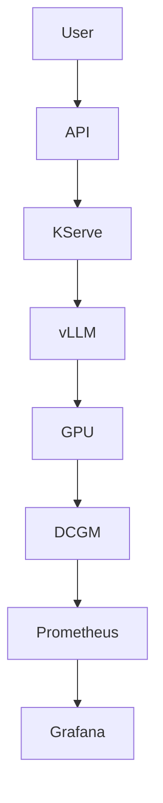

# AI INFRASTRUCTURE ENGINEER

## Complete Learning, Lab & Portfolio Repository

---

# 1. PROJECT PURPOSE

Build a complete self-learning and portfolio repository for becoming an:

**AI Platform Engineer → AI Infrastructure Engineer → AI Infrastructure / Platform Architect**

The repository must combine:

1. Structured learning material
2. Practical hands-on labs
3. Infrastructure automation
4. GPU infrastructure
5. AI inference
6. Observability
7. Troubleshooting
8. Architecture design
9. Interview preparation
10. A complete end-to-end Mini AI Factory portfolio project

The project must be practical and engineering-oriented.

It must NOT become a generic AI/ML learning repository.

---

# 2. LEARNER PROFILE

The learner is an experienced Principal-level software engineer with:

* approximately 18 years IT experience
* approximately 10 years Java/software development
* approximately 8 years software packaging/installer engineering
* strong enterprise software experience
* DevOps experience
* Terraform/Ansible exposure
* currently learning Kubernetes
* Kubernetes learning is being done separately through KodeKloud

The learner wants to transition toward:

**AI Platform Engineering**

with a long-term goal of:

**AI Infrastructure / AI Platform Architecture**

The learner is particularly interested in:

* GPU infrastructure
* AI factories
* Kubernetes
* cloud infrastructure
* AI platforms
* infrastructure automation
* observability
* distributed GPU computing
* AI inference
* AI data-center technology

The learner does NOT want to become:

* an ML researcher
* a data scientist
* a deep-learning researcher
* a generic AI application developer

---

# 3. KUBERNETES SCOPE

Kubernetes is explicitly OUT OF SCOPE as a standalone learning module.

The learner is studying Kubernetes through KodeKloud.

Do NOT create a duplicate Kubernetes course.

However, Kubernetes may be used throughout the project.

When Kubernetes concepts are required, explain only the minimum necessary and add:

> Kubernetes fundamentals are covered separately through KodeKloud.

The project should assume the learner understands:

* Pods
* Deployments
* Services
* ConfigMaps
* Secrets
* StatefulSets
* DaemonSets
* namespaces
* RBAC
* volumes
* scheduling
* taints/tolerations
* affinity
* Helm
* networking
* CRDs
* Operators

---

# 4. CORE MENTAL MODEL

Everything in this repository must reinforce this architecture:

```
                USERS
                  |
                  v
          +---------------+
          |   AI PLATFORM  |
          +---------------+
                  |
                  v
           +-------------+
           | Kubernetes  |
           +-------------+
                  |
                  v
         GPU SCHEDULING
                  |
                  v
         NVIDIA GPU OPERATOR
                  |
         +--------+--------+
         |                 |
         v                 v
    GPU SOFTWARE       OBSERVABILITY
         |                 |
         v                 v
      CUDA             DCGM
         |                 |
         v                 v
   NVIDIA DRIVER      Prometheus
         |                 |
         v                 v
        GPU              Grafana
         |
   +-----+------+
   |            |
   v            v
NVLink       PCIe
   |
   v
```

GPU NETWORK
|
+---+-------------+
|                 |
v                 v
InfiniBand          RoCE
|                 |
+-------+---------+
|
NCCL
|
v
DISTRIBUTED AI

AI SERVING:

vLLM
Triton
KServe

DISTRIBUTED COMPUTE:

Ray

ML LIFECYCLE:

MLflow
Kubeflow

AUTOMATION:

Terraform
Ansible

This architecture should appear repeatedly throughout the repository.

---

# 5. LEARNING ROADMAP

Follow this sequence:

Phase 0
AI Factory fundamentals

Phase 1
Linux for AI infrastructure

Phase 2
Containers

Phase 3
GPU fundamentals

Phase 4
CUDA fundamentals

Phase 5
NVIDIA GPU Operator

Phase 6
GPU scheduling + GPU sharing + MIG

Phase 7
NCCL + GPU networking

Phase 8
DCGM + Prometheus + Grafana

Phase 9
vLLM

Phase 10
Triton

Phase 11
KServe

Phase 12
Ray

Phase 13
MLflow

Phase 14
Kubeflow

Phase 15
Terraform

Phase 16
Ansible

Phase 17
Mini AI Factory

Phase 18
Troubleshooting

Phase 19
Architecture Design

Phase 20
Interview Preparation

Phase 21
Career / Skill Matrix

---

# 6. REPOSITORY STRUCTURE

Create the following repository:

ai-infrastructure-engineer/

├── README.md
├── ROADMAP.md
├── PROGRESS.md
├── ARCHITECTURE.md
├── COPILOT_PROJECT_SPEC.md
│
├── docs/
│   ├── 00-ai-factory/
│   ├── 01-linux/
│   ├── 02-containers/
│   ├── 03-gpu/
│   ├── 04-cuda/
│   ├── 05-gpu-operator/
│   ├── 06-gpu-scheduling/
│   ├── 07-nccl-networking/
│   ├── 08-observability/
│   ├── 09-vllm/
│   ├── 10-triton/
│   ├── 11-kserve/
│   ├── 12-ray/
│   ├── 13-mlflow/
│   ├── 14-kubeflow/
│   ├── 15-terraform/
│   ├── 16-ansible/
│   ├── 17-mini-ai-factory/
│   ├── 18-troubleshooting/
│   ├── 19-architecture/
│   ├── 20-interview/
│   └── 21-career/
│
├── labs/
│   ├── linux/
│   ├── containers/
│   ├── gpu/
│   ├── cuda/
│   ├── gpu-operator/
│   ├── scheduling/
│   ├── networking/
│   ├── observability/
│   ├── vllm/
│   ├── triton/
│   ├── kserve/
│   ├── ray/
│   ├── mlflow/
│   ├── kubeflow/
│   └── mini-ai-factory/
│
├── infrastructure/
│   ├── terraform/
│   └── ansible/
│
├── manifests/
│   ├── gpu/
│   ├── monitoring/
│   ├── vllm/
│   ├── triton/
│   └── kserve/
│
├── scripts/
│   ├── diagnostics/
│   ├── gpu/
│   ├── networking/
│   └── benchmarking/
│
├── dashboards/
│   └── grafana/
│
├── diagrams/
│
├── examples/
│
└── interview/
├── beginner/
├── intermediate/
└── architect/

---

# 7. DOCUMENTATION STANDARD

Every learning module MUST contain:

## 7.1 Learning objectives

What the learner should know after completing the module.

## 7.2 Why this technology exists

Start with the problem.

## 7.3 Simple explanation

Explain it as if teaching an experienced software engineer entering infrastructure.

## 7.4 Analogy

Always provide a practical analogy.

## 7.5 Architecture

Provide ASCII diagrams.

## 7.6 Deep technical explanation

Explain internal architecture where relevant.

## 7.7 Real-world example

Use realistic AI infrastructure scenarios.

## 7.8 Commands

Provide executable commands.

## 7.9 Hands-on lab

Every important concept should have a practical exercise.

## 7.10 Troubleshooting

Show failure scenarios.

## 7.11 Interview questions

Include questions and answers.

## 7.12 Architecture questions

Include design/trade-off questions.

## 7.13 Completion checklist

The learner must know when the module is actually finished.

---

# 8. AI FACTORY DOMAIN

Create a fictional company:

# Acme AI Cloud

Acme operates AI infrastructure for:

* banks
* healthcare companies
* government
* software companies
* startups

Acme provides:

* GPU compute
* AI model inference
* model hosting
* distributed training infrastructure
* AI platform services

Use Acme consistently throughout examples.

---

# 9. AI FACTORY MODULE

Explain:

What is an AI Factory?

Explain:

Traditional Data Center
vs
AI Data Center
vs
AI Factory
vs
Cloud GPU provider
vs
Colocation provider
vs
AI Compute-as-a-Service provider

Explain:

Power
Cooling
Racks
GPU servers
CPU
RAM
GPU memory
Storage
Networking
InfiniBand
Ethernet
RoCE
RDMA
NVLink
NVSwitch
Kubernetes
GPU Operator
Observability
AI serving

Show a complete physical-to-logical architecture.

---

# 10. LINUX MODULE

Focus specifically on AI infrastructure.

Teach:

Processes
Threads
CPU
Memory
Virtual memory
Filesystem
Disk
I/O
Users
Groups
Permissions
systemd
Services
Logs
Networking
Sockets
Ports
DNS
Routing
SSH
Kernel
Kernel modules
PCIe
Devices

Commands must include practical examples.

Create:

linux-diagnostics.sh

The script should collect:

CPU
memory
disk
network
kernel
PCIe
processes
services

The script must produce a readable diagnostic report.

---

# 11. CONTAINER MODULE

Create labs covering:

Docker/OCI
Images
Layers
Registry
Container lifecycle
Namespaces
cgroups
Volumes
Networking
containerd

Create:

Dockerfile examples.

Also explain:

GPU container architecture.

Create:

gpu-container-test.sh

The script should determine:

Is NVIDIA driver available?

Is GPU visible?

Can the container access the GPU?

What GPU model is available?

---

# 12. GPU FUNDAMENTALS MODULE

Teach:

GPU architecture
SM
CUDA cores
Tensor cores
VRAM
HBM
Memory bandwidth
PCIe
NVLink
NVSwitch
NUMA
GPU topology
Power
Thermals
Clocks

Create diagrams.

Teach nvidia-smi.

Create:

gpu-health-check.sh

The script should collect:

GPU name
GPU utilization
memory utilization
temperature
power
clocks
driver version
CUDA compatibility information
running processes

---

# 13. CUDA MODULE

Explain:

CUDA architecture.

Teach:

Driver
Toolkit
Runtime
Libraries
cuBLAS
cuDNN
NCCL

Create:

CUDA compatibility troubleshooting guide.

Create a decision tree:

GPU not detected
|
+-- Host?
|
+-- Driver?
|
+-- Container?
|
+-- Runtime?
|
+-- Application?

---

# 14. GPU OPERATOR MODULE

Explain:

Why GPU Operator exists.

Teach:

NVIDIA driver
Container Toolkit
Device Plugin
GPU Feature Discovery
DCGM
DCGM Exporter
Operator
CRDs
DaemonSets

Create practical Kubernetes manifests.

Create:

gpu-operator-validation.md

Validation checklist:

[ ] GPU node detected

[ ] NVIDIA driver working

[ ] Device plugin running

[ ] GPU resource advertised

[ ] CUDA workload starts

[ ] GPU visible inside pod

[ ] DCGM metrics available

---

# 15. GPU SCHEDULING MODULE

Teach:

GPU resource requests

Node labels

Node selectors

Affinity

Anti-affinity

Taints

Tolerations

Topology

GPU sharing

Time slicing

MIG

MIG profiles

Capacity planning

GPU fragmentation

Multi-tenancy

Create scenarios.

Example:

Cluster:

Node A
8 GPUs

Node B
8 GPUs

Node C
4 GPUs

Customer A needs:

4 GPUs

Customer B needs:

2 GPUs

Customer C needs:

1 GPU

Show how scheduling decisions work.

---

# 16. NCCL + NETWORKING MODULE

Teach:

NCCL

AllReduce

AllGather

ReduceScatter

Broadcast

NVLink

PCIe

NVSwitch

InfiniBand

RoCE

RDMA

GPUDirect concepts

Explain latency vs bandwidth.

Create network architecture diagrams.

Create a troubleshooting guide.

Create NCCL benchmark labs where hardware permits.

Explain why:

8 GPUs != automatically 8x performance.

---

# 17. OBSERVABILITY MODULE

Create an observability architecture:

GPU
↓
DCGM
↓
DCGM Exporter
↓
Prometheus
↓
Grafana

Monitor:

GPU utilization
GPU memory
temperature
power
clock
errors
CPU
memory
disk
network
Kubernetes state
pod restarts
inference latency
throughput
tokens/sec
TTFT

Create Grafana dashboard definitions where practical.

Create alerts.

Example:

GPU temperature too high.

GPU utilization low for long duration.

GPU memory almost full.

GPU error detected.

Node unavailable.

Inference latency too high.

---

# 18. vLLM MODULE

Teach:

LLM inference

Model loading

GPU memory

KV cache

Continuous batching

Concurrency

Throughput

Latency

TTFT

Tokens/sec

Tensor parallelism

Replication

Autoscaling

Create deployment examples.

Create:

load-test script

The script should generate configurable concurrent requests.

Measure:

Requests/sec

Average latency

P95 latency

P99 latency

TTFT

Tokens/sec

GPU utilization

GPU memory

Create a performance analysis exercise.

---

# 19. TRITON MODULE

Teach:

Triton architecture

Model repository

Model configuration

Batching

Dynamic batching

Multiple models

GPU execution

Metrics

Compare:

vLLM vs Triton.

Explain when Triton is better.

---

# 20. KSERVE MODULE

Teach:

KServe architecture

InferenceService

Model deployment

Scaling

Autoscaling

Networking

Canary

Inference runtimes

Explain:

vLLM = inference engine

Triton = inference server

KServe = Kubernetes model-serving platform/control layer

Create architecture diagrams.

---

# 21. RAY MODULE

Teach:

Ray architecture

Tasks

Actors

Ray cluster

Distributed execution

GPU workloads

Training workloads

Inference workloads

Explain:

Kubernetes vs Ray.

Core distinction:

Kubernetes manages infrastructure/workloads.

Ray manages distributed application execution.

---

# 22. MLFLOW MODULE

Teach:

Experiments

Parameters

Metrics

Artifacts

Model registry

Model lifecycle

Explain:

MLflow is not Kubernetes.

MLflow is not Ray.

MLflow is not Kubeflow.

Create:

Developer
↓
Experiment
↓
MLflow
↓
Model Registry
↓
Deployment

---

# 23. KUBEFLOW MODULE

Teach:

Kubeflow architecture

Pipelines

Training

Notebooks

Model lifecycle

Kubernetes integration

Distributed workloads

Explain:

Kubeflow vs MLflow

Kubeflow vs Ray

Kubeflow vs KServe

---

# 24. TERRAFORM MODULE

Teach Terraform specifically for AI infrastructure.

Create examples for:

Network
VM
GPU VM
Storage
Security
Kubernetes infrastructure

Explain:

terraform plan
terraform apply
terraform destroy

Teach:

Modules
Variables
Outputs
State
Remote state
Drift

Create reusable modules.

---

# 25. ANSIBLE MODULE

Teach:

Inventory
Playbooks
Roles
Variables
Handlers
Idempotency

Create playbooks for:

Linux preparation

GPU node preparation

Package installation

User creation

System configuration

Service configuration

Monitoring prerequisites

---

# 26. MINI AI FACTORY

This is the flagship portfolio project.

Project name:

# Acme AI Factory

Build:

## Layer 1

Infrastructure

## Layer 2

Linux

## Layer 3

Container runtime

## Layer 4

Kubernetes

## Layer 5

NVIDIA GPU Operator

## Layer 6

GPU scheduling

## Layer 7

Observability

## Layer 8

vLLM

## Layer 9

Triton/KServe

## Layer 10

Terraform

## Layer 11

Ansible

---

# 27. MINI AI FACTORY — INITIAL VERSION

Minimum environment:

1 GPU node

Components:

Linux

Container runtime

Kubernetes

GPU Operator

DCGM

Prometheus

Grafana

vLLM

Small open LLM

API

Create an architecture diagram.

Create installation scripts.

Create validation scripts.

Create monitoring dashboard.

Create documentation.

---

# 28. MINI AI FACTORY — ADVANCED VERSION

Add:

Second GPU node

GPU scheduling

GPU affinity

Taints/tolerations

NCCL

Multi-GPU workload

Distributed communication

KServe or Triton

Terraform

Ansible

Load testing

Capacity analysis

Failure testing

---

# 29. PRODUCTION ARCHITECTURE

Design:

Acme AI Cloud production environment.

Example:

100+ GPU nodes.

Multiple GPU types.

Multiple customers.

Multi-tenancy.

Observability.

High availability.

Network redundancy.

Storage.

Security.

Identity.

Secrets.

API gateway.

Inference services.

Scheduling.

Capacity planning.

Create:

Physical architecture

Logical architecture

Network architecture

Software architecture

Observability architecture

Security architecture

Automation architecture

---

# 30. FAILURE ENGINEERING

Create a failure-testing section.

Test:

GPU failure

Node failure

Network failure

Disk failure

Container failure

GPU memory exhaustion

Model loading failure

CUDA mismatch

Driver failure

NCCL failure

Prometheus failure

Grafana failure

vLLM failure

KServe failure

Create:

Symptom

Detection

Diagnosis

Recovery

Prevention

for every failure.

---

# 31. PERFORMANCE ENGINEERING

Create a dedicated section.

Explain:

Latency

Throughput

Bandwidth

Utilization

Queue time

GPU memory

CPU bottleneck

Network bottleneck

Storage bottleneck

Scaling efficiency

Cost efficiency

Create exercises:

GPU utilization = 20%

GPU utilization = 95%

GPU memory = 99%

Network = saturated

CPU = saturated

NCCL = slow

Inference latency = high

Determine the likely bottleneck.

---

# 32. CAPACITY PLANNING

Teach:

GPU capacity planning.

Example:

Customer requires:

500 requests/sec

Average input tokens:

1,000

Average output tokens:

500

Target latency:

< 2 seconds

Determine:

GPU requirement

Replica requirement

Capacity headroom

Scaling strategy

Explain that exact capacity depends on model, GPU type, quantization, batching and workload characteristics.

Do NOT invent universal performance numbers.

---

# 33. COST ENGINEERING

Teach:

GPU cost

Power

Cooling

Rack

Network

Storage

Software

Operations

Cloud GPU cost

On-prem GPU cost

Utilization

TCO

Create a simple AI infrastructure cost model.

Explain:

Why GPU utilization is a business metric.

---

# 34. SECURITY

Teach AI infrastructure security at platform level.

Topics:

RBAC

Secrets

Network policies

Container security

Image scanning

Supply chain

GPU tenant isolation

API security

TLS

Identity

Audit logging

Least privilege

Explain how security changes in a multi-tenant GPU environment.

---

# 35. TROUBLESHOOTING HANDBOOK

Create at least 30 realistic problems.

Examples:

GPU missing

Driver mismatch

CUDA mismatch

GPU Operator failure

Pod scheduling failure

GPU memory exhausted

Low GPU utilization

High GPU temperature

NCCL failure

RDMA issue

Network latency

vLLM model failure

vLLM latency

Prometheus metric missing

Grafana dashboard empty

Node failure

Container failure

Storage failure

Create decision trees.

---

# 36. ARCHITECTURE CASE STUDIES

Create at least 10.

Examples:

1. 8-GPU inference cluster
2. 32-GPU training cluster
3. 64-GPU distributed training
4. 1000-GPU AI factory
5. Multi-tenant AI cloud
6. Government AI platform
7. Enterprise private AI platform
8. LLM inference platform
9. AI compute-as-a-service
10. Hybrid cloud AI infrastructure

Each case study must include:

Requirements

Assumptions

Architecture

Technology selection

Trade-offs

Failure scenarios

Scaling

Observability

Security

Cost considerations

---

# 37. INTERVIEW PREPARATION

Create:

100 beginner questions

100 intermediate questions

100 advanced questions

100 architecture/scenario questions

Questions should emphasize:

WHY

TRADE-OFFS

TROUBLESHOOTING

ARCHITECTURE

rather than memorization.

Include model answers.

---

# 38. MOCK INTERVIEWS

Create 10 mock interviews.

Each should simulate an AI Infrastructure Engineer interview.

Format:

Interviewer question

Candidate answer

Follow-up question

Strong answer

Weak answer

Architect-level answer

---

# 39. DAILY LEARNING MODE

Create:

DAILY_LEARNING.md

The learner should be able to work through the project sequentially.

Each day:

1. Learn
2. Read
3. Lab
4. Troubleshoot
5. Explain
6. Record notes
7. Check completion

---

# 40. PROGRESS TRACKER

Create:

PROGRESS.md

Example:

## Phase 1 — Linux

[ ] Processes

[ ] Memory

[ ] Filesystem

[ ] Networking

[ ] systemd

[ ] Troubleshooting

[ ] Lab completed

[ ] Interview questions completed

[ ] Can explain without notes

Repeat for every module.

---

# 41. ARCHITECTURE JOURNAL

Create:

ARCHITECTURE_JOURNAL.md

After each module the learner must answer:

What problem does this technology solve?

Where does it fit?

What existed before it?

What are its limitations?

What are alternatives?

What can fail?

How would I monitor it?

How would I scale it?

How would I explain it to an architect?

---

# 42. PORTFOLIO DOCUMENTATION

The final project must contain:

README

Architecture diagram

Architecture decision records

Installation guide

Operations guide

Troubleshooting guide

Monitoring guide

Performance report

Capacity report

Security model

Cost model

Demo instructions

Screenshots

Sample dashboards

Sample metrics

Design decisions

Lessons learned

---

# 43. ARCHITECTURE DECISION RECORDS

Create ADR templates.

Examples:

ADR-001

Why Kubernetes?

ADR-002

Why NVIDIA GPU Operator?

ADR-003

Why vLLM?

ADR-004

Why Prometheus/Grafana?

ADR-005

Why Terraform + Ansible?

ADR-006

Why KServe/Triton?

ADR-007

GPU sharing strategy

ADR-008

Network architecture

Each ADR must include:

Context

Problem

Options

Decision

Reasoning

Trade-offs

Consequences

---

# 44. DIAGRAMS

Create diagrams in Mermaid wherever possible.

Use:

flowcharts

sequence diagrams

architecture diagrams

network diagrams

component diagrams

Example:



Store diagrams in:

/diagrams

---

# 45. AUTOMATION

Scripts should be:

* readable
* idempotent where applicable
* documented
* safe
* configurable
* not hard-coded unnecessarily

Use:

Bash

Python

Terraform

Ansible

YAML

Avoid unnecessary programming complexity.

---

# 46. ENVIRONMENT SUPPORT

The project must distinguish:

LOCAL

CLOUD

ON-PREMISES

For GPU labs, clearly state:

Minimum hardware

Recommended hardware

Cloud alternative

No-GPU alternative

Never assume the learner owns an expensive GPU server.

---

# 47. VERSIONING

Do not hard-code old versions without explanation.

Whenever a version matters:

* mention the version used in the lab
* mention that versions change
* separate conceptual knowledge from version-specific commands
* prefer official documentation for current installation instructions

Do not fabricate commands.

If uncertain about a current command, explicitly mark it:

"Verify against the current official documentation."

---

# 48. TECHNICAL ACCURACY

Never invent:

* benchmark numbers
* GPU performance
* cloud prices
* compatibility matrices
* unsupported features
* product capabilities

When discussing current versions or compatibility, use official documentation where possible.

Clearly separate:

FACT

ASSUMPTION

EXAMPLE

ILLUSTRATION

---

# 49. COPILOT WORKFLOW

Do NOT generate the entire repository in one request.

Work incrementally.

First create:

README.md

ROADMAP.md

PROGRESS.md

ARCHITECTURE.md

Then generate each module individually.

After every module:

1. Review
2. Test commands
3. Fix errors
4. Add labs
5. Add troubleshooting
6. Add diagrams
7. Add interview questions
8. Update progress tracker

---

# 50. COPILOT ROLE SWITCHING

Use different prompts during the project.

## Teacher mode

"Teach this topic clearly."

## Architect mode

"Review this architecture as a senior AI infrastructure architect."

## SRE mode

"Find operational and reliability problems."

## Security mode

"Review this for security weaknesses."

## Performance engineer mode

"Find bottlenecks and optimization opportunities."

## Interviewer mode

"Interview me on this topic."

## Code reviewer mode

"Review the scripts and infrastructure code."

## Technical editor mode

"Remove repetition and improve clarity without reducing technical depth."

---

# 51. MASTER QUALITY REVIEW

When the entire repository is finished, perform a final audit.

Check:

[ ] Linux coverage

[ ] Containers

[ ] GPU architecture

[ ] CUDA

[ ] GPU Operator

[ ] GPU scheduling

[ ] MIG

[ ] NCCL

[ ] InfiniBand

[ ] RoCE

[ ] RDMA

[ ] DCGM

[ ] Prometheus

[ ] Grafana

[ ] vLLM

[ ] Triton

[ ] KServe

[ ] Ray

[ ] MLflow

[ ] Kubeflow

[ ] Terraform

[ ] Ansible

[ ] Security

[ ] Troubleshooting

[ ] Performance

[ ] Capacity planning

[ ] Cost

[ ] Architecture

[ ] Interview preparation

[ ] Capstone

---

# 52. FINAL SKILL ASSESSMENT

Create a final assessment containing:

50 multiple-choice questions

50 technical questions

25 troubleshooting scenarios

25 architecture scenarios

10 hands-on challenges

5 complete system-design problems

The final assessment should determine whether the learner is ready for:

AI Platform Engineer

or

AI Infrastructure Engineer

or

Senior AI Infrastructure Engineer

or

AI Infrastructure Architect

---

# 53. FINAL CAPSTONE PRESENTATION

Create:

FINAL_PRESENTATION.md

The learner should be able to present the project in 15–20 minutes.

Structure:

1. Business problem
2. What is an AI Factory?
3. Architecture
4. GPU infrastructure
5. Kubernetes
6. GPU Operator
7. Scheduling
8. Networking
9. Observability
10. AI serving
11. Automation
12. Security
13. Failure handling
14. Performance
15. Cost
16. Scaling
17. Future improvements

---

# 54. MOST IMPORTANT RULE

Do not optimize this project for:

"How many technologies did I learn?"

Optimize it for:

**"Can I design, deploy, operate, troubleshoot and explain an AI infrastructure platform?"**

The learner should finish the project with the ability to reason about the entire stack.

The ultimate skill model is:

```
             AI APPLICATION
                   |
                   v
             AI PLATFORM
                   |
                   v
              KUBERNETES
                   |
                   v
            GPU SCHEDULING
                   |
                   v
           GPU OPERATOR
                   |
                   v
                 CUDA
                   |
                   v
                NVIDIA
                   |
                   v
             GPU HARDWARE
                   |
      +------------+------------+
      |                         |
      v                         v
   NVLink                  NETWORK FABRIC
                                |
                     +----------+----------+
                     |                     |
                     v                     v
                InfiniBand               RoCE
                     |
                     v
                   RDMA
                     |
                     v
                   NCCL
                     |
                     v
            DISTRIBUTED COMPUTE

              OBSERVABILITY
                   |
      +------------+------------+
      |                         |
     DCGM                  Kubernetes
      |                         |
      +------------+------------+
                   |
               Prometheus
                   |
                Grafana

             AI SERVING
                   |
      +------------+------------+
      |            |            |
    vLLM        Triton       KServe

          AI PLATFORM TOOLS
                   |
      +------------+------------+
      |            |            |
     Ray         MLflow      Kubeflow

             AUTOMATION
                   |
      +------------+------------+
      |                         |
  Terraform                  Ansible
```

This complete stack is the target skillset.

---

# 55. MODULE GENERATION PROTOCOL

Generate one explicitly named module at a time. Do not create or populate any other module unless asked in a later instruction. Keep each module detailed enough for an experienced software engineer to study independently, with practical examples and Mermaid and/or ASCII architecture diagrams. Follow the module-specific requirements in this specification as well as the documentation standard.

For every command, explain its purpose, expected output, and common failure cases. State platform, access, version, and environment assumptions; do not fabricate commands or imply that a read-only example changes state. For every lab, include prerequisites, setup, steps, validation, troubleshooting, cleanup, and completion criteria. Include minimum hardware, recommended hardware, cloud alternative, and no-GPU alternative where relevant.

After drafting a module, self-review it from all three perspectives below, fix issues found, and only then finish:

1. Senior AI Infrastructure Architect: validate boundaries, component roles, flows, trade-offs, and alignment with the repository architecture.
2. SRE: validate operability, observability, failure handling, safety, validation, and cleanup.
3. Technical interviewer: validate conceptual clarity, technical depth, realistic scenarios, and useful questions and answers.

Do not advance to the next module as part of the current task.

---

# 56. MODULE REVIEWER GATE

Before improving or finalizing any module, review the complete current module as a Senior AI Infrastructure Architect. Do not rewrite it blindly. First report findings, then make only targeted changes supported by the specification and technical reasoning. Do not start or populate another module.

Check and explicitly assess:

1. Technical inaccuracies, version-sensitive or outdated assumptions, and claims presented without evidence.
2. Missing concepts required by this module and weak explanations that prevent an experienced software engineer from studying independently.
3. Architecture relationships and boundaries, including control plane, workload/data plane, management/reconciliation, storage, network, and observability paths where relevant.
4. Missing realistic troubleshooting: symptom, detection, diagnosis, recovery, and prevention as appropriate to the module.
5. Missing or unsafe labs, prerequisites, local/cloud/on-premises/no-GPU alternatives, validation, cleanup, and completion criteria.
6. Unrealistic, destructive, unscoped, or insufficiently explained commands; each command needs purpose, expected output, environment assumptions, and common failures.
7. Missing interview and architecture trade-off questions that test reasoning rather than product-name recall.
8. Unnecessary or duplicated content, while preserving required repetition that serves a different learning or reference purpose.
9. Readiness for real AI Infrastructure / AI Platform Engineering work: ownership, operability, reliability, security, capacity, cost, and evidence-based decision-making as relevant.

Classify findings by severity and distinguish definite errors/omissions from optional improvements. Preserve correct material, resolve material issues before finishing, and state any deliberate deferrals that belong to a later module. Run the available focused validation after edits and report any environment-dependent checks that could not be run.
