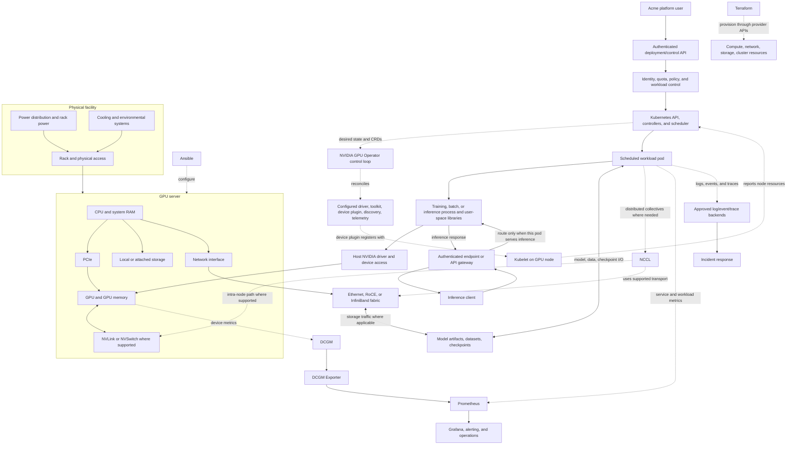

# Phase 0: AI Factory Fundamentals

## Module Purpose

This module builds the system-level map for the rest of the repository. It explains what an AI factory is, how it differs from a data center or infrastructure provider, and how physical facilities and hardware become a usable AI platform.

The running example is **Acme AI Cloud**, a fictional provider serving banks, healthcare organizations, government, software companies, and startups. Acme offers GPU compute, model hosting and inference, distributed training infrastructure, and platform services. These are design examples, not claims about any real provider or compliance certification. Customer contracts and threat models determine the controls a real service must meet.

This is a conceptual and read-only discovery module. It does not install software, deploy Kubernetes resources, require a GPU, or teach Kubernetes as a standalone course.

## Learning Objectives

After completing this module, you should be able to:

- Define an AI factory and distinguish it from a traditional data center, AI data center, cloud GPU provider, colocation provider, and AI Compute-as-a-Service provider.
- Trace a workload from facility power and cooling through racks, servers, GPU software, orchestration, serving, and observability.
- Explain the different jobs performed by CPU, system RAM, GPU memory, local/shared storage, Ethernet, RoCE, InfiniBand, RDMA, PCIe, NVLink, and NVSwitch.
- Describe how Kubernetes and the NVIDIA GPU Operator participate in GPU workload enablement without conflating them with the physical GPU or model-serving runtime.
- Place vLLM, Triton, KServe, Ray, MLflow, Kubeflow, DCGM, Prometheus, Grafana, Terraform, and Ansible at the right architectural boundary.
- Separate control-plane, inference/data-plane, storage/network, and telemetry flows in a diagram.
- Ask the business, reliability, capacity, security, operational, and cost questions needed to turn an AI workload into a supportable service.
- Produce and defend a first-pass AI factory design for Acme AI Cloud, with facts, assumptions, unknowns, and owners clearly identified.

## What Is an AI Factory?

An AI factory is an operating capability that repeatedly converts infrastructure capacity, software, data/model artifacts, and operational processes into usable AI workloads and services. It includes more than the equipment: platform interfaces, scheduling and policy, workload runtimes, observability, security, capacity planning, service ownership, and recovery processes all matter.

The term is not a single standardized product boundary. Vendors and organizations may use it differently. When using the term in a design, state whether you mean a physical facility, an infrastructure platform, a managed service, or the complete operating model.

### Related Models and Provider Boundaries

These categories overlap; classify a service by what it owns and what it sells, not by its marketing label.

| Model | What it primarily provides | Typical customer responsibility | Distinction to preserve |
| --- | --- | --- | --- |
| Traditional data center | A facility and general-purpose compute environment: space, power, cooling, network, storage, and servers. | Depends on ownership model; a private data center owner may operate most layers. | It can run AI, but its design may not be optimized for dense accelerator power, cooling, or GPU fabrics. |
| AI data center | A facility and hardware environment designed to support AI-scale compute, often with higher rack power, GPU servers, specialized cooling, and high-bandwidth fabrics. | Depends on whether it is privately owned, cloud-operated, or colocated. | It is a physical infrastructure design, not automatically an AI platform or factory operating model. |
| AI factory | An integrated capability to provision, schedule, run, govern, observe, and support AI workloads. | The platform/provider team owns the agreed service boundary; tenants consume the provided capability. | It can span one or more facilities and can use cloud or colocation capacity. |
| Cloud GPU provider | On-demand or reserved GPU infrastructure, commonly virtual machines or managed cluster services, plus cloud control-plane capabilities. | Customer responsibilities vary: images, drivers, cluster, identity, data, serving, or some subset. | Confirm which layer is managed; “cloud GPU” does not imply managed model serving or end-to-end operations. |
| Colocation provider | Space, power, cooling, physical security, and connectivity for customer-owned equipment; services vary by contract. | Customer commonly owns/operates servers, software, and workload platform. | Colo supplies facility capabilities; it is not automatically the owner of GPU scheduling or inference SLOs. |
| AI Compute-as-a-Service provider | A customer-facing service abstraction for GPU compute, training, inference, or some combination, often metered or quota-based. | Customer responsibility depends on the service API and contract boundary. | It may be built on cloud, colo, or owned facilities; it typically abstracts more of the stack than raw GPU hosting. |

For Acme, the phrase **AI factory** means the end-to-end service capability. Acme could own an AI data center, lease a colocation facility, consume cloud GPU capacity, or combine them. The architecture must make the provider/customer responsibility boundary explicit in each case.

## Why It Exists

A single developer can experiment on a workstation. A provider serving many independent organizations must handle shared and expensive capacity, repeatable deployments, data and identity boundaries, predictable service behavior, and failures across many technical layers.

Without an integrated operating model, common outcomes include GPU capacity that exists physically but cannot be scheduled, a model that works on one host but not another, unexplained latency, unsafe sharing, idle accelerators, unreliable upgrades, and unclear incident ownership. An AI factory joins the layers and assigns responsibility so that a customer request can be delivered and supported as a service.

## Simple Explanation and Analogy

Think of an AI factory as a **shared industrial workshop with a dispatch desk and a control room**:

- The facility supplies power, cooling, space, and connectivity.
- GPU servers are specialized machines; CPU and RAM handle general host work and feed them.
- A dispatch system assigns jobs to suitable available equipment.
- Work cells run different processes: training, batch work, and request-serving.
- The control room observes health, throughput, errors, and alarms.
- Maintenance and operations teams handle repair, upgrades, capacity, and safe use.
- The platform is the customer-facing service desk/API that makes the workshop usable without every customer independently wiring the facility.

This analogy helps explain shared capacity, dependencies, and ownership. It is not a performance model: software workloads are elastic, GPU memory and host memory are distinct, and network contention or model behavior can dominate in ways a physical workshop analogy does not predict.

## Physical-to-Logical Architecture

### ASCII Architecture

```text
PHYSICAL FACILITY
Power/grid -> electrical distribution/UPS -> rack PDU -> GPU server
Cooling plant -> room/rack/server cooling
Rack, physical access, and BMC management are facility/operations concerns.

GPU SERVER AND FABRIC
CPU + system RAM -> PCIe -> GPU(s) -> GPU memory (VRAM/HBM)
GPU(s) <-> NVLink/NVSwitch where supported (intra-node GPU interconnect)
Ethernet: management, API, storage, and other supported network traffic
GPU servers <-> Ethernet/RoCE or InfiniBand fabric for distributed workloads
RDMA is a capability over a compatible, configured fabric, not a fabric itself.

PLATFORM DEPLOYMENT AND MANAGEMENT PLANE
Platform user -> identity/control API -> policy/quota -> Kubernetes API/scheduler
GPU Operator controller watches/reconciles configured node GPU components.
The Operator is not a hop in the inference request or GPU execution path.

WORKLOAD EXECUTION PATH
Kubernetes schedules workload pod -> application/container -> CUDA/runtime libraries
Application -> host NVIDIA driver/device interface -> GPU
Inference runtime: vLLM or Triton; optional KServe serving-control layer

ONLINE INFERENCE REQUEST PATH
Inference client -> authenticated endpoint/API gateway -> serving application
Serving application -> endpoint/API gateway -> inference client response

STORAGE AND DISTRIBUTED COMPUTE PATHS
Model artifacts/datasets -> approved storage and network path -> workload
Workload -> approved storage path -> checkpoints and generated artifacts
Distributed workload -> NCCL collectives -> supported GPU links/fabric
NCCL use and transport depend on workload, topology, and configuration.

OBSERVABILITY AND AUTOMATION
GPU -> DCGM -> DCGM Exporter -> Prometheus -> Grafana/alerts/on-call
Host/workload metrics -> Prometheus
Logs/events/traces -> approved backends -> incident response
Terraform -> provider APIs -> compute/network/storage/cluster resources
Ansible -> host OS and service configuration
```

This is a logical reference, not a required physical bill of materials. Cooling technology, power redundancy, storage topology, network fabric, GPU interconnect, and software components depend on scale, hardware, provider boundary, and service objectives. A single diagram should not imply that every technology is installed in every environment.

### Mermaid Architecture



The standalone Mermaid source for this architecture is [diagrams/00-ai-factory-architecture.mmd](../../diagrams/00-ai-factory-architecture.mmd).

The telemetry and automation arrows are management/operations paths, not part of the normal model request. The GPU Operator reconciles selected cluster GPU software components; it is not a device, model server, or request-path proxy. Terraform provisions resources exposed by a provider/API and should not be read as directly provisioning physical racks. Storage may be local, shared file, block, or object storage; its access protocol and network path depend on the environment. NCCL provides collectives for supported distributed workloads, while the topology and configured transport determine how communication moves between GPUs and hosts.

## Deep Technical Explanation

### Facility, Rack, and Server

**Power** is a capacity and availability constraint, not just a utility bill. Plan for the power path, rack distribution, redundancy target, monitoring, and the load a server can sustain. Redundancy claims must state what failure they cover; two power feeds do not help if they share an upstream failure domain.

**Cooling** removes heat generated by servers and networking. Air cooling and liquid-assisted approaches are design choices determined by hardware density, facility capabilities, serviceability, and vendor requirements. Do not assume that a particular cooling method is universal for every GPU rack.

**Racks** organize servers, switches, cabling, and power distribution. Density increases pressure on power, cooling, cabling, physical access, and maintenance. Rack placement can also be a failure-domain and network-topology decision.

Inside a GPU server:

- **CPU** runs the host operating system, orchestration agents, input processing, application threads, and control logic. A GPU-heavy system can still be CPU-bound.
- **System RAM** holds host processes, buffers, caches, and data before/after transfers. It is not the same pool as GPU memory.
- **GPU memory** (commonly VRAM and, on many data-center accelerators, HBM) stores model weights, activations, caches, and runtime data according to workload and implementation. Capacity and bandwidth are distinct properties.
- **Local storage** can hold images, caches, scratch data, or checkpoints; shared/object storage may provide durable artifacts or datasets. Local scratch should not be mistaken for durable storage.
- **BMC and management access** provide out-of-band server control/telemetry on supported equipment. This path should be separated and protected from customer workload traffic.

### Host, GPU, and Node Interconnects

- **PCIe** connects CPUs, GPUs, NICs, storage, and other devices. Its topology and generation affect host-device transfers and device placement; verify the actual system topology rather than assuming every GPU has equal paths.
- **NVLink** is a high-speed GPU interconnect on supported systems. **NVSwitch** can provide switched GPU-to-GPU connectivity in specific platforms. They are intra-node GPU communication technologies, not substitutes for the data-center network.
- **Ethernet** commonly carries client/API, management, storage, and general service traffic. High-speed Ethernet may also carry distributed GPU traffic.
- **RoCE** carries RDMA traffic over Ethernet. It depends on a compatible end-to-end network and host configuration; merely having Ethernet does not guarantee a functional RoCE path.
- **InfiniBand** is a network fabric commonly used for high-performance cluster communication and supports RDMA operation in appropriately configured systems.
- **RDMA** is a communication capability that can allow one host to access memory on another with reduced CPU involvement under supported conditions. It is not a fabric itself, and it is not automatically active because a NIC advertises support.

Network traffic classes should be designed and observed deliberately: customer/API traffic, storage access, management, and distributed workload communication can have different latency, bandwidth, isolation, and failure requirements.

### Storage and Data Movement

Model weights, datasets, container images, checkpoints, and generated artifacts have different access and durability needs. A workload may read images and model artifacts during startup, stream or stage datasets while running, and write checkpoints or outputs. Those paths can use local disks, shared file systems, block devices, object stores, or a combination. Local scratch can be fast but is not automatically durable; a shared/object store can be durable but may add startup time, throughput limits, request costs, or network contention. Identify who owns each store, how access is authenticated, what data is retained, and whether recovery depends on it. Do not assume a storage product or protocol from the existence of a GPU cluster.

### Host Software and GPU Enablement

The operating system kernel interacts with hardware through drivers and device interfaces. NVIDIA's driver exposes device capabilities to supported user-space software. CUDA is a platform/runtime and toolchain ecosystem used by many GPU applications; CUDA libraries such as cuBLAS, cuDNN, and NCCL provide specialized capabilities used by some workloads. A container packages user-space dependencies, but it does not magically remove host-driver and device compatibility requirements.

In a Kubernetes deployment, the NVIDIA GPU Operator can manage or coordinate configured GPU components such as the driver, container toolkit, device plugin, GPU Feature Discovery, and DCGM Exporter. The precise components and ownership depend on operator configuration and environment. The device plugin registers with kubelet; kubelet reports node capacity and allocatable resources to the API server, which the scheduler uses when placing workloads, subject to constraints and available capacity.

The request path does not literally pass through the operator. The operator is a management/reconciliation mechanism. Once a workload is running, its process uses the runtime, libraries, driver, and device path.

For supported distributed GPU workloads, NCCL provides collective operations such as all-reduce and all-gather. It coordinates communication using the available intra-node GPU links and configured inter-node transport; it is neither the physical fabric nor the cluster scheduler. Topology, NIC configuration, software compatibility, and workload behavior determine whether adding GPUs improves useful throughput. Detailed NCCL tuning belongs to the later networking module.

### Logical Platform and Workload Roles

The **control plane** accepts workload intent, identity, policy, quota, deployment configuration, and placement. The **data plane** performs model computation, data movement, request handling, and distributed communication. A healthy Kubernetes API does not prove that a model endpoint is meeting latency targets; a running endpoint does not prove that the control plane can safely roll it out.

| Technology | Typical role in the architecture | Boundary reminder |
| --- | --- | --- |
| Kubernetes | Workload orchestration and cluster resource control. | Assumed knowledge here; not a separate course in this repository. |
| NVIDIA GPU Operator | Manages/configures selected GPU software components in Kubernetes. | Not GPU hardware, the model runtime, or the scheduler itself. |
| vLLM | LLM inference engine/runtime. | Can run as a service without making KServe mandatory. |
| Triton | Inference server with supported backends and serving capabilities. | Runtime and model support must be validated for the use case. |
| KServe | Kubernetes model-serving control/platform layer that can integrate with runtimes. | Not the inference engine itself in the general case. |
| Ray | Distributed application execution framework used by suitable workloads. | Does not replace Kubernetes infrastructure scheduling or GPU enablement. |
| MLflow | Experiment tracking and model lifecycle/registry capabilities. | Not Kubernetes, Ray, or necessarily in the live request path. |
| Kubeflow | Components/workflows for ML platform and lifecycle needs. | Not required for every factory; select components by need. |
| DCGM | NVIDIA GPU management/telemetry capabilities. | Telemetry needs collection, retention, visualization, and ownership. |
| Prometheus / Grafana | Metrics collection/query and visualization/alert workflows. | A dashboard without actionable alerts and ownership is not an operations model. |
| Terraform / Ansible | Infrastructure provisioning / host and service configuration automation. | Define state ownership to avoid competing automation systems. |

AI serving systems are one workload category. Training, fine-tuning, batch inference, interactive inference, and distributed compute have different runtime, scheduling, data, checkpoint, latency, and recovery needs. One platform may support all of them, but a single queue policy or SLO rarely describes them all well.

### Observability, Reliability, and Security

Observe across boundaries:

- **Facility/host:** power and cooling alarms where available, CPU/RAM pressure, storage, NIC and link state, kernel/device errors.
- **GPU:** device health, memory, utilization, temperature, power, clocks, and error signals where supported.
- **Cluster/platform:** node conditions, resource capacity/allocatable values, pending work, scheduling delay, deployment state, quota denials, and API health.
- **Workload/service:** job progress, queue time, request rate, error rate, latency percentiles, model load/startup, throughput, tokens per second where meaningful, and saturation.
- **Operations:** alert ownership, runbooks, escalation, change history, capacity forecast, and recovery evidence.

DCGM and its exporter can provide GPU metrics; Prometheus can collect metrics; Grafana can visualize them. Logs, traces, events, and application metrics add context. Missing telemetry is an observability failure or a gap to investigate, not proof that a device is idle or healthy.

Reliability objectives depend on workload. Online inference needs request-level availability, error, and latency goals. Training may prioritize time-to-completion, checkpoint recovery, queue delay, and reproducibility. A platform should define failure domains, rollout behavior, degraded modes, and ownership before an incident.

For Acme, a multi-tenant design must state how customers authenticate, what they can access, how secrets and model/data artifacts are protected, how quotas and priorities work, how workloads are isolated, how images and infrastructure changes are trusted, and who receives audit/incident evidence. Requirements for banks, healthcare, and government must be established with the relevant customers and security/legal owners; this learning example does not assert compliance.

### Capacity, Performance, and Cost Reasoning

Do not turn a GPU count into a throughput promise. Capacity depends on model, GPU type and memory, precision/quantization, request mix, context/input/output sizes, batching, concurrency, runtime settings, topology, CPU/input pipeline, storage, network, and service objective. Validate through representative tests in later modules. The specification explicitly forbids inventing universal performance numbers.

For an initial design, distinguish:

- **Installed capacity:** physical devices and host/network resources present.
- **Enabled capacity:** healthy, software-compatible resources exposed to the platform.
- **Schedulable capacity:** enabled resources available after placement constraints, quotas, reservations, and fragmentation.
- **Effective service capacity:** the measured work the system can deliver while meeting its objective, including recovery and rollout headroom.

Cost includes accelerators, CPU/RAM, storage, fabric, facility power and cooling, licenses/software, operations, and idle or reserved headroom. Higher utilization may lower cost per useful unit of work, but pushing utilization to its maximum can damage latency, recovery, or fairness. Define a business-relevant unit, such as a successful request or completed job, and evaluate quality alongside utilization.

## Acme AI Cloud: Worked Architecture Example

Acme receives a request from a software-company customer for a private inference endpoint. The customer provides its model and target request profile under an approved data-handling agreement. The design team does not start by choosing a GPU count; it first records required availability, p95/p99 latency, peak request rate, model/context characteristics, region/data boundary, expected growth, and support window.

An illustrative service flow is:

1. Customer identity reaches Acme's API/platform boundary; authentication, authorization, quota, and request policy are applied.
2. A serving deployment is managed through the selected platform path. KServe may be selected if its deployment abstractions fit; otherwise the runtime can be managed by another supported workflow.
3. A selected inference runtime such as vLLM or Triton loads the model and executes on scheduled GPU capacity.
4. Host, GPU, runtime, and API signals are collected separately from customer request traffic.
5. Acme's on-call owner uses service and infrastructure telemetry to distinguish model/runtime saturation from scheduling, node, network, storage, or control-plane faults.
6. Infrastructure and host changes follow explicit Terraform/Ansible ownership and change processes; neither tool handles the online inference request.

For a bank, healthcare, or government tenant, Acme would additionally validate customer-specific identity, network, retention, isolation, audit, residency, and contractual requirements with the appropriate owners. The fictional example does not prescribe a compliance design.

## Command Guide

All commands below are **read-only discovery**. The Kubernetes commands require `kubectl`, a valid kubeconfig, an approved context, and sufficient permissions. The GPU command requires a Linux environment with an NVIDIA driver and accessible device. A macOS laptop or CPU-only cloud shell may correctly lack these tools; use the no-GPU lab alternative instead. Do not run mutating commands in an environment you do not own.

### 1. Query Host-Visible NVIDIA GPUs

```bash
nvidia-smi
```

- **What it does:** Queries NVIDIA's management interface for visible devices, driver version, GPU model, memory, utilization, temperature, and processes (exact columns vary by platform/version).
- **Expected output:** A device table for visible GPUs. On a GPU-enabled host, model names and current readings appear; utilization can be zero when idle.
- **Common failures:** `command not found` means the utility is absent or not on `PATH`; `No devices were found` can mean no attached GPU, unavailable device passthrough, or driver/device initialization problems; an NVML/driver error can indicate a mismatch or failed driver. This command is not supported on a standard macOS laptop without an NVIDIA Linux device environment.

### 2. Verify the Active Kubernetes Context

```bash
kubectl config current-context
```

- **What it does:** Prints the currently selected cluster/user context name. It does not contact the API server and does not prove that the identity is authorized.
- **Expected output:** One context name. Confirm it is the approved development/lab context before any cluster query.
- **Common failures:** `kubectl: command not found` means the client is missing; no current context means kubeconfig has no active selection. If the displayed context is unfamiliar or production, stop and follow the environment owner's context-selection process.

### 3. Inspect Cluster Nodes

```bash
kubectl get nodes -o wide
```

- **What it does:** Lists registered nodes with readiness, version, internal IP, operating system image, and runtime information.
- **Expected output:** One row per visible node. `Ready` means the node reports ready to Kubernetes; it does not prove GPU health, model readiness, or an inference SLO.
- **Common failures:** Timeout/connection errors can indicate an unreachable API server, stale context, VPN/network issue, or cluster outage. `Forbidden` indicates insufficient authorization. No rows may reflect cluster state or restricted visibility.

### 4. Inspect GPU Node Resources

Replace `GPU_NODE_NAME` with a node name from `kubectl get nodes -o wide`:

```bash
kubectl describe node GPU_NODE_NAME
```

- **What it does:** Shows labels, taints, conditions, capacity, allocatable resources, and recent events for one node. Look for an advertised resource such as `nvidia.com/gpu` when the relevant device-plugin configuration is active.
- **Expected output:** A detailed node report. GPU capacity/allocatable counts depend on hardware, plugin configuration, partitioning/sharing, and health.
- **Common failures:** `NotFound` usually means the placeholder or node name is wrong/stale; `Forbidden` indicates insufficient permission. Missing GPU resources are evidence to investigate, not a diagnosis by themselves.

### 5. Inspect Visible Workloads

```bash
kubectl get pods -n APPROVED_NAMESPACE
```

- **What it does:** Lists pods in one namespace. Replace `APPROVED_NAMESPACE` with a namespace the environment owner has authorized you to inspect.
- **Expected output:** Pod name, readiness, phase, restart count, and age. Some pods may legitimately be `Completed`; `Running` alone does not prove application health. The namespace column is omitted because the query is scoped to one namespace.
- **Common failures:** `NotFound` can mean the namespace name is wrong or unavailable to this context; `Forbidden` means the identity cannot list pods there. API connection errors share the causes described above. Do not broaden to all namespaces to work around a permission error. This summary does not explain why a pod is pending or restarting; use permitted events/logs and the owning team's runbook.

## Hands-On Labs

No lab below creates or changes infrastructure. **Minimum hardware:** none. **Recommended hardware:** a Linux NVIDIA GPU host and an authorized non-production Kubernetes environment. **Local:** complete the diagrams and scenario work on a laptop; GPU and cluster inspection are optional. **Cloud:** use only an approved read-only development host/cluster, and do not provision resources for this module. **On-premises:** use an owner-approved lab host/cluster and read-only access. **No-GPU alternative:** use the evidence/assumption mapping and scenario exercises in Labs 1-3.

### Lab 1: Classify Acme's Service Boundary

**Goal:** Distinguish facility/provider responsibility from Acme's platform responsibility and customer workload responsibility.

**Prerequisites**

- This module and a blank table or diagramming surface.
- No software, cluster, or GPU required.

**Setup**

Create a responsibility matrix with rows for facility/power/cooling, rack/server, host OS/driver, GPU enablement, Kubernetes, model runtime, customer identity/data, observability, patching, incident response, and capacity. Use columns for Acme-owned, provider-owned, customer-owned, shared, and unknown.

**Steps**

1. Choose one deployment model from the comparison table: Acme-owned facility, colocation, cloud GPU, or AI Compute-as-a-Service.
2. Assign each responsibility based on the chosen contract boundary. For every shared or unknown row, name the decision/contract needed.
3. Trace one customer's inference request from identity/API to runtime/GPU and back.
4. Draw power/cooling and network dependencies beneath the logical workload path.
5. Draw metrics/logs/events to the operations path separately; name the team who owns each alert.
6. Mark each diagram statement as **FACT**, **ASSUMPTION**, **EXAMPLE**, or **UNKNOWN**.

**Validation**

- The selected provider model has an explicit customer/provider responsibility boundary.
- At least one physical dependency (power, cooling, rack, or fabric) connects to the workload's availability.
- User request, management/control, and telemetry paths are distinguishable.
- No named technology appears without a stated role and owner.

**Troubleshooting**

- **Every layer is marked Acme-owned:** Revisit cloud/colo/service contract boundaries; verify rather than assume.
- **“Provider-managed” is vague:** Split it into facility, server, operating system, cluster, runtime, and service responsibilities.
- **No owner for alerts:** Add a service owner and escalation path; dashboards alone do not operate a service.
- **Unknowns are being guessed:** Mark them unknown and identify the safe evidence source or decision maker.

**Cleanup**

No environment changes occur. Store or discard the matrix according to project confidentiality rules; do not record real customer-sensitive architecture in an unapproved location.

**Completion Criteria**

- The matrix has an owner or explicit unresolved decision for every row.
- The request and telemetry flows reach named operational boundaries.
- The chosen provider model is distinguished by responsibility, not branding.

### Lab 2: Build a Physical-to-Logical Inventory

**Goal:** Connect observable host/cluster facts to a layered architecture while keeping assumptions separate from evidence.

**Prerequisites**

- A place to record results.
- Optional, approved read-only access to a Linux NVIDIA host and a non-production Kubernetes context.
- If no hardware is available, use a hypothetical environment and label all details as assumptions.

**Setup**

1. Select a lab environment. Do not use production unless inspection is explicitly authorized.
2. If using Kubernetes, run `kubectl config current-context` from the command guide and confirm the context with its owner.
3. Identify one GPU node name if the approved environment exposes one.

**Steps**

1. On an approved GPU host, run `nvidia-smi` and record only the visible device/driver facts needed for your diagram.
2. On the approved cluster, run `kubectl get nodes -o wide`; then inspect a selected node with `kubectl describe node GPU_NODE_NAME`.
3. Run `kubectl get pods -n APPROVED_NAMESPACE` only if your identity is authorized for that namespace. Record visible GPU/operator/monitoring components, but do not infer health from names alone.
4. Place each observed fact at a layer: facility, server, host software, device enablement, scheduler, workload, service, or telemetry.
5. Add missing layers with dashed/unknown boundaries and identify what additional approved evidence would validate each.
6. Draw the request path and the telemetry path. Explain which path would be investigated first for a failed customer request.

**Validation**

- Each statement is marked observed, documented, or assumed.
- The diagram does not claim that `Ready` proves GPU or application health.
- Physical GPU presence, Kubernetes-advertised GPU capacity, and pod-level GPU visibility are recorded as separate facts.
- The monitoring path is not drawn as part of normal inference traffic.

**Troubleshooting**

- **No `nvidia-smi`:** Use the no-GPU alternative; do not install a driver on a shared host.
- **No active Kubernetes context:** Stop cluster inspection and ask the environment owner for the approved setup.
- **Node has no advertised GPU resource:** Record it as a finding. Hardware absence, driver/operator/device-plugin state, or policy/configuration may explain it; this lab does not alter the cluster to investigate.
- **Cannot list pods in the approved namespace:** Omit pod details and ask the environment owner if access is expected; do not broaden permissions for this exercise.
- **Output appears inconsistent:** Capture command, context, time, and node identity, then ask the owner. Avoid concluding that the whole stack is broken from one layer's output.

**Cleanup**

All commands are read-only; no cluster or host state is changed. Handle captured output under your organization's data policy. Remove any personal notes only if required by that policy; do not delete shared resources.

**Completion Criteria**

- A physical-to-logical diagram has at least one verified host/cluster fact or an explicitly labeled no-hardware assumption.
- GPU visibility is differentiated across hardware, node advertisement, and workload access.
- You can point to one safe next diagnostic for an unknown without making an unapproved change.

### Lab 3: Design Acme's Workload and Capacity Policy

**Goal:** Show how workload intent, availability, capacity, failure domains, and cost shape the platform design without inventing performance numbers.

**Prerequisites**

- Paper, spreadsheet, or diagramming tool.
- No shell commands or infrastructure required.

**Setup**

Acme receives these illustrative requests:

| Tenant | Workload | Stated need |
| --- | --- | --- |
| Bank customer | Online inference | Defined request-latency and availability objectives; data and identity requirements still need customer/security validation. |
| Healthcare customer | Batch inference | A daily completion window; workload may be retried if input/output handling is safe. |
| Government customer | Model hosting | Explicit isolation, access, audit, and location requirements to be confirmed contractually. |
| Startup customer | Fine-tuning experiment | Flexible start time and resumability preferred; capacity and model are not yet characterized. |

Assume for the arithmetic exercise only that one candidate cluster has two worker nodes and each node has four GPUs. Do **not** infer model fit or requests/second from this count.

**Steps**

1. Classify each workload as online inference, batch inference, hosting, or fine-tuning/training; distinguish service latency from queue delay and job completion time.
2. For each tenant, list inputs needed before capacity sizing: model, model memory, input/output/context sizes, concurrency/rate, runtime, data path, and service objective.
3. Write down nominal physical GPU count. Then calculate remaining physical GPUs after losing one node. Label both figures as illustrative inventory, not schedulable or effective service capacity.
4. Define separate policy questions for identity/isolation, quotas/priorities, preemption/retry, rollout, and failure recovery.
5. Identify at least five bottleneck candidates across CPU, GPU memory/compute, host-device transfer, storage/input pipeline, network/fabric, and serving queue.
6. Propose an evidence plan: representative load test, model compatibility test, failure/rollout test, and telemetry review. State what the test must measure.
7. Compare one shared pool with workload classes against separate pools. Explain utilization, isolation, latency, stranded capacity, and operating complexity trade-offs.
8. Mark any compliance, data-residency, or customer security requirement as a requirement to validate with its owner; do not claim certification from this exercise.

**Validation**

- The inventory arithmetic is 2 x 4 = 8 physical GPUs; one-node loss leaves 1 x 4 = 4 physical GPUs in this simplified scenario.
- The conclusion explicitly says this arithmetic does not prove model fit, throughput, memory capacity, schedulability, or SLO performance.
- Each workload has an owner, success objective, and list of missing sizing inputs.
- The design separates physical capacity, enabled capacity, schedulable capacity, and measured service capacity.
- A customer-facing service has an observability and recovery plan, not just a deployment plan.

**Troubleshooting**

- **A GPU count becomes a replica count:** Remove the assumption; measure model memory and per-replica behavior on the selected hardware/runtime.
- **Requests/sec is guessed:** Record it as unknown and design a representative load test; do not insert invented benchmark values.
- **All tenants share a namespace/pool by default:** Revisit threat model, data boundary, quota, workload interference, and contract requirements with owners.
- **High utilization is the only optimization goal:** Add latency, errors, fairness, completion time, and recovery measures.
- **Failure headroom is double-counted:** Recalculate steady state, rollout, and node-loss cases independently using placement and startup assumptions.

**Cleanup**

No infrastructure is created. Retain the assumptions and evidence plan as a design artifact, or discard them; there are no environment resources to remove.

**Completion Criteria**

- Workloads have differentiated objectives and missing capacity inputs.
- The failure-domain and shared-versus-isolated pool trade-offs are documented.
- No universal throughput, GPU performance, price, or compliance claim is introduced.
- The design names owners for decisions about tenant boundaries, SLOs, security, and recovery.

## Troubleshooting: First-Pass Failure Map

The dedicated Troubleshooting phase will contain the repository-wide handbook and broad failure catalogue. This Phase 0 map is a first-pass orientation, not a substitute for the later specialist modules.

| Symptom | Detection | Diagnosis focus | Recovery direction | Prevention |
| --- | --- | --- | --- | --- |
| Server cannot be powered on | BMC/asset state, facility alarms, power telemetry, operator report. | Separate server fault from rack PDU, upstream circuit, maintenance, and facility issue. | Escalate to the facility/server owner; restore only through the approved power procedure. | Maintain power-path diagrams, capacity alarms, and tested escalation/maintenance procedures. |
| GPU server thermally throttles or shuts down | GPU/host telemetry, cooling alarms, hardware events, workload timeline. | Correlate device temperature/load with cooling path, airflow/liquid loop, and neighboring equipment. | Preserve evidence and involve hardware/facility operations; reduce or drain load only under the approved runbook. | Monitor thermal and cooling signals, validate rack design, and exercise maintenance procedures. |
| Physical GPU exists but Kubernetes does not advertise it | Compare `nvidia-smi` evidence with node capacity/allocatable and GPU component health. | Check driver, Operator configuration, device plugin, node health, and resource policy boundary by boundary. | Route to the GPU platform owner; apply a reviewed configuration/repair after cause is established. | Validate GPU advertisement after node provisioning/upgrades and alert on expected-resource gaps. |
| Pod remains pending | Workload events, scheduler reason, quota, node allocatable resources, taints/affinity. | Determine whether the blocker is capacity, request shape, policy, topology, or node health. | Correct the request or approved policy, or add capacity; do not restart a healthy GPU node without evidence. | Test representative placement, publish resource classes, and monitor queue/scheduling delay. |
| Container cannot see device | Device allocation/events, host GPU visibility, runtime configuration, application error. | Separate missing allocation from host driver, container integration, library compatibility, or image defect. | Roll back an incompatible image/configuration or route a node defect to its owner. | Pin and validate supported image/driver combinations and run a GPU visibility check in release tests. |
| Model fails to load | Deployment events/logs, artifact access, model-load error, GPU memory state. | Distinguish access/format/runtime incompatibility from insufficient memory or startup timeout. | Restore artifact access, use a supported runtime/image, or right-size using measured evidence. | Test model artifacts and startup on the target stack; document memory/startup assumptions. |
| Inference tail latency increases | SLO alert and request latency percentiles correlated with queue, runtime, host, and GPU signals. | Split queueing, request mix, CPU/input pipeline, model/runtime, GPU, storage, and network hypotheses. | Apply a scoped mitigation such as traffic shaping or rollback only with service-owner approval and measured impact. | Establish a representative baseline, SLO dashboards, rollout guardrails, and load tests. |
| Multi-node training slows | Job progress by rank/node, job duration, link telemetry, input pipeline, recent changes. | Compare compute, synchronization, topology, storage input, and network/RDMA evidence against a baseline. | Restore a known-good configuration or reduce scope while the fabric/workload owner isolates the bottleneck. | Validate topology and communication before scale-out; retain benchmark and configuration baselines. |
| GPU dashboard goes blank | Scrape target status, exporter health/logs, query/labels, dashboard permissions. | Trace the telemetry path from device/exporter through scrape, storage, query, and visualization. | Restore the failed telemetry component or use approved device/host diagnostics while metrics recover. | Alert on telemetry-target loss and test dashboard/query changes before rollout. |
| Deployment succeeds but endpoint is unavailable | Readiness, model-load state, service routing, auth response, and a permitted synthetic request. | Separate object creation from serving readiness, routing, credentials, and runtime health. | Roll back or route traffic to a known-good deployment; follow the service runbook. | Gate traffic on meaningful readiness and test end-to-end service behavior during rollout. |
| GPU utilization is high but jobs make little progress | Compare utilization/memory with job progress, errors, throughput, queue, and synchronization. | Investigate memory pressure, inefficient kernels, stalls, retries, communication, and input starvation. | Reduce workload concurrency or restore a known-good configuration if users/jobs are impacted; preserve evidence. | Track progress and useful throughput with utilization; establish workload-specific alerts and baselines. |
| GPU utilization is low under a slow endpoint | Correlate latency with queue, CPU/tokenization, storage/network, batching, and GPU signals. | Look for a non-GPU bottleneck or underfilled workload before changing accelerator count. | Mitigate the evidenced bottleneck or adjust request admission/batching with service-owner approval. | Load-test representative request mixes and instrument latency by stage. |

These recovery directions are not authorization to change a shared or production environment. Follow the system owner's runbook, preserve evidence, and use an approved change path.

For every incident, record impact, affected tenant/workload, start time, recent changes, evidence, mitigation, owner, and next update. Preserve logs/events under the applicable retention policy. Make only approved, reversible changes and record outcomes. The dedicated Troubleshooting module will expand this pattern into the spec's 30-problem handbook with symptom, detection, diagnosis, recovery, and prevention for each case.

## Interview Preparation

### Technical Questions and Model Answers

**1. What is an AI factory?**  
An operating capability that combines infrastructure, accelerator enablement, orchestration, workload platforms, governance, and operations to deliver repeatable AI workloads and services. It is broader than a data center or GPU cluster.

**2. Distinguish an AI data center from an AI factory.**  
An AI data center is a physical facility/hardware environment designed to support AI workloads. An AI factory is the end-to-end service and operating model; it may use one or multiple AI data centers, cloud GPUs, or colo capacity.

**3. How does a cloud GPU provider differ from a colo provider?**  
A cloud GPU provider generally sells on-demand/reserved compute and cloud control-plane services, with a variable management boundary. A colo provider primarily supplies facility space, power, cooling, and connectivity for customer equipment. Contracts determine the actual division of responsibility.

**4. Explain CPU RAM versus GPU memory.**  
CPU RAM serves host processes and buffers; GPU memory is local to the accelerator and holds workload data such as weights and activations. Capacity, bandwidth, transfer path, and software visibility differ, so one cannot be treated as a transparent extension of the other.

**5. What are NVLink/NVSwitch and PCIe used for?**  
PCIe connects host and devices; NVLink and supported NVSwitch configurations provide GPU-to-GPU connectivity within particular systems. Actual topology matters. None of these is the data-center fabric between arbitrary racks.

**6. Is RoCE the same as Ethernet?**  
RoCE carries RDMA communication over Ethernet. It requires compatible NICs, network configuration, and host/software support; ordinary Ethernet connectivity alone does not prove the RDMA path is configured or healthy.

**7. What does the NVIDIA GPU Operator do?**  
It manages or coordinates selected GPU software components in a Kubernetes environment, such as driver/toolkit/device-plugin/telemetry components depending on configuration. It does not replace physical infrastructure, scheduler policy, model serving, or software compatibility validation.

**8. How do vLLM, Triton, and KServe relate?**  
vLLM is an inference engine/runtime, Triton is an inference server with supported backends, and KServe is a Kubernetes-oriented serving platform/control layer that can integrate with runtimes. A design can use a runtime without KServe; support and integration must be validated.

**9. Why is eight GPUs not a performance guarantee?**  
Throughput depends on model, GPU type/memory, software, request mix, batching, communication, CPU/input pipeline, storage/network, and service targets. Parallel workloads also pay coordination and communication costs. Measure the intended workload on the intended topology.

**10. What would you observe for a production inference service?**  
Request rate, errors, latency percentiles, queueing, startup/readiness, model/runtime signals, GPU memory/utilization/health, host resources, node and scheduling health, and network/storage evidence as applicable. Tie alerts to SLOs, owners, and runbooks.

**11. Does high GPU utilization prove good service?**  
No. It may coexist with poor latency, errors, memory exhaustion, or low useful throughput. Evaluate utilization with user outcomes, progress, queue depth, and saturation.

**12. Where do Terraform and Ansible fit?**  
Terraform commonly provisions infrastructure resources; Ansible commonly configures hosts and services. Define who owns each state and lifecycle so automation does not conflict. Neither belongs in the online request path.

**13. How do model artifacts, datasets, and checkpoints affect the architecture?**  
They create startup, runtime, durability, access-control, and recovery paths that are separate from GPU compute. Identify the store and protocol, who owns it, how workloads authenticate, what is staged locally, what must survive a node loss, and how storage/network limits affect startup and job progress.

**14. What role does NCCL play in a distributed GPU workload?**  
NCCL provides collective communication operations for supported GPU workloads. It uses available intra-node links and/or configured inter-node transports; it does not supply the fabric, schedule the job, or guarantee linear scaling. Validate topology and communication behavior with the real workload.

### Architecture and Trade-Off Questions

**Design Acme's service for a bank, a startup, and a healthcare customer. Would they use the same GPU pool?**  
First clarify each tenant's data/access boundary, availability, latency, workload type, burst pattern, hardware needs, audit requirements, and contractual obligations. A shared pool may raise utilization but requires tested isolation, quotas, fair scheduling, and noisy-neighbor controls. Dedicated pools can improve isolation and predictability but cost more and can strand capacity. Select based on threat model and measured interference, not industry label alone; have customer/security owners validate requirements.

**Would you build a new AI data center or buy cloud GPU capacity?**  
Compare demand stability, utilization, time-to-capacity, hardware lifecycle, data location, network locality, power/cooling/real-estate availability, operations expertise, managed-service boundary, and total cost including idle reserve. On-prem can improve control and predictable high utilization but has procurement and facility lead time; cloud can provide elasticity but has quota, cost, and service-boundary considerations. A hybrid model may help but adds connectivity and operations complexity.

**How would you design a multi-node training fabric?**  
Establish workload communication patterns, scale, target performance, failure behavior, and support constraints. Validate per-node GPU topology and selected Ethernet/RoCE or InfiniBand design, RDMA configuration, NIC placement, storage/input path, congestion/isolation, and telemetry. Test with the real workload and an appropriate benchmark; do not infer linear scaling from GPU count.

**How would you make model loading and checkpoint recovery reliable across GPU-node loss?**  
Identify artifact and checkpoint stores, durability and retention requirements, access identity, network dependency, load time, checkpoint frequency/consistency, and restore behavior. Test recovery on a replacement node and include storage availability and recovery time in the service objective. Do not assume local scratch survives node replacement.

**A customer endpoint has high p99 latency and GPU utilization is 25%. What next?**  
Confirm the SLO breach and request mix, then decompose queue, admission, model/runtime, CPU/tokenization, storage, network, and GPU time. Check errors, queue depth, CPU/memory, model loading, batch/concurrency, and recent changes. A low GPU signal suggests investigation; it is not a root cause. Apply a scoped mitigation only after evidence and owner approval.

**What does production readiness mean for this service?**  
Documented service objectives and ownership; security/data boundaries; tested deployment/rollback; capacity and failure-domain plan; useful telemetry and actionable alerts; incident/runbook and escalation path; patch/change process; cost/capacity review; and evidence that representative workloads meet the objectives. A diagram or successful demo alone is not readiness.

## Completion Checklist

- [ ] Explain AI factory, AI data center, cloud GPU provider, colo provider, and AI Compute-as-a-Service by responsibility boundary.
- [ ] Identify power, cooling, racks, GPU servers, CPU, system RAM, GPU memory, storage, and physical access/management in the physical view.
- [ ] Explain the roles and boundaries of Ethernet, RoCE, InfiniBand, RDMA, PCIe, NVLink, and NVSwitch.
- [ ] Trace physical hardware through Linux/driver/runtime, GPU enablement, Kubernetes scheduling, workload/serving, and operations.
- [ ] Draw user/request, control, infrastructure/network, and observability flows distinctly.
- [ ] Place every named platform technology in the role table without treating the stack as one mandatory chain.
- [ ] Complete all three labs, including the no-GPU alternative where hardware is unavailable.
- [ ] Diagnose at least three Phase 0 symptoms by proposing evidence and an owner before a change.
- [ ] Answer the technical and architecture questions with assumptions and trade-offs, not product-name recitation.
- [ ] Record unresolved capacity, security, provider-boundary, and recovery decisions with responsible owners.

## Review Findings Resolved

- Separated GPU Operator reconciliation from Kubernetes scheduling and the workload-to-GPU execution path.
- Added model/data/checkpoint storage flows, the NCCL collective-communication role, and provider-scoped Terraform relationships.
- Scoped pod inspection to an approved namespace and stated local, cloud, and on-premises lab options.
- Added interview coverage for storage recovery and NCCL trade-offs.
- Retained both ASCII and Mermaid views because the spec calls for both forms; removed the repeated role-review narrative that did not add learning value.

## Scope Note

Kubernetes appears as the assumed workload orchestration substrate only. This is not a standalone Kubernetes module. Kubernetes fundamentals are covered separately through KodeKloud.
