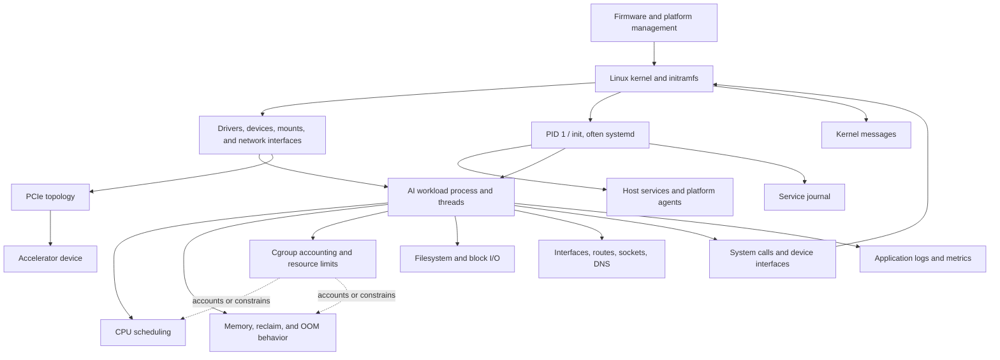

# Phase 1: Linux for AI Infrastructure

## Purpose

Linux is the operating environment beneath most self-managed AI worker nodes. GPU frameworks do not bypass the host: processes are scheduled by the CPU, memory is accounted at host and control-group boundaries, filesystems feed models and datasets, the kernel manages devices and networking, and service managers start and supervise platform agents. When a GPU workload is slow or a node disappears, Linux evidence often determines whether the fault is application, host, storage, network, or device related.

This module teaches host-level Linux for AI infrastructure. It does not teach Kubernetes, container internals, CUDA, NVIDIA driver installation, or distributed-network tuning as standalone subjects; those are later phases. Commands are read-only unless explicitly called out, and this module intentionally does not provide mutating remediation commands.

The examples use **Acme AI Cloud**, a fictional provider operating GPU worker nodes for multiple customer workloads. Names and incidents are illustrative, not product-specific claims.

## Learning Objectives

After completing this module, you should be able to:

- Explain how Linux boots into a service-ready AI worker and identify the responsibilities of the kernel, PID 1/service manager, and user processes.
- Distinguish processes, threads, CPU scheduling, load average, memory availability, virtual memory, cgroup accounting, and pressure signals.
- Investigate filesystem capacity, block devices, mounts, and I/O latency without assuming every full filesystem is the root cause.
- Explain users, groups, ownership, permissions, least privilege, and why shared-worker access must be scoped.
- Inspect systemd units and journal logs while accounting for distribution and permission differences.
- Trace network evidence across addresses, routes, sockets, DNS resolution, and an SSH connection attempt.
- Locate kernel, module, PCIe, and device evidence relevant to a GPU host without attempting driver installation or hardware changes.
- Use the diagnostic script to produce a bounded, read-only report and interpret unavailable or denied probes correctly.
- Work from a service symptom toward evidence-based hypotheses, owners, and safe next checks.

## Why Linux Matters on an AI Worker

A workload can request accelerators correctly and still make poor progress because its CPU threads are throttled, memory is under pressure, a data volume is slow, a DNS lookup fails, or a host service is unhealthy. The GPU is one part of a system whose other layers prepare data, launch processes, move bytes, expose devices, and report health.

Linux knowledge helps answer practical questions:

- Is the process alive, blocked, repeatedly restarting, or unable to create threads?
- Is host memory genuinely exhausted, or is memory being used as reclaimable page cache?
- Does the workload have a cgroup CPU quota or memory limit that differs from node-wide capacity?
- Is a filesystem out of space, or is the storage path experiencing latency or queueing?
- Can the host resolve and route to the model or artifact service?
- Did the kernel log a device, PCIe, filesystem, or network event before the application failed?

## Simple Explanation and Analogy

Treat a Linux AI node like a **busy depot**. The kernel is the dispatcher that allocates CPU time, maps memory, routes I/O, and mediates hardware access. Processes are jobs; threads are workers within a job. RAM is the workbench, disk and remote storage are shelves, interfaces and routes are roads, and systemd is the service coordinator that starts and supervises long-running operations. Logs are the event ledger.

The analogy is useful for asking where work is blocked, but it is not literal. Linux scheduling is preemptive; virtual memory is not simply “extra RAM”; page cache may be reclaimable; and a cgroup can constrain one process even when the host has spare capacity. Always check measurements and scope.

## Boot-to-Workload Architecture

### ASCII View

```text
Firmware / platform management
        |
        v
Boot loader -> Linux kernel + initramfs -> drivers, devices, mounts
                                        |
                                        v
                                   PID 1 / init
                                   (often systemd)
                                        |
                 +----------------------+----------------------+
                 |                      |                      |
                 v                      v                      v
            host agents          storage/network         logging/services
                 |                      |                      |
                 +----------------------+----------------------+
                                        |
                                        v
                            AI workload process/threads
                               |       |         |
                               v       v         v
                              CPU   memory    I/O/network
                               ^       ^
                               |       |
                    cgroup accounting/limits

Workload -> system calls/device interface -> kernel driver -> PCIe -> device

Evidence: /proc, /sys, systemd/journal, iproute2, procps,
          filesystem/block tools, PCIe inventory, application telemetry
```

### Mermaid View



The diagram describes relationships, not an exact boot sequence for every Linux distribution. PID 1 may not be systemd, service dependencies vary, and the hardware/driver stack depends on the node image and vendor support matrix.

## Deep Technical Explanation

### Boot, Services, and Readiness

Firmware initializes the platform and selects a boot path. A boot loader loads the kernel and often an initramfs, which makes early storage and drivers available. The kernel initializes memory management, schedulers, device discovery, filesystems, and networking, then starts PID 1. On many server distributions PID 1 is systemd, which starts units according to dependency/order relationships. Other Linux environments use a different init system or, inside a container, no full host init system at all.

The boot-to-workload path is therefore not just “Linux started.” A node can have a running kernel but a failed mount, a delayed network, or a service that never reaches readiness. A unit reported as `active` is process/unit state, not proof that a platform agent or model service is ready. A reliable node lifecycle should define which services and dependencies must be ready before workloads are admitted.

### Processes, Threads, and CPU

A process has an address space and operating-system resources. Threads within a process share much of that state while having their own execution state and stack. A program may create many threads; thread count alone does not reveal useful parallelism. CPU affinity, scheduler policy, runnable queues, locks, and cgroup quota can all affect progress.

**Load average is not CPU utilization.** It estimates tasks that are runnable or in certain uninterruptible wait states over several time windows. High load can come from CPU demand or blocked I/O; low CPU utilization alongside high load can be a clue to waiting, not proof of a CPU shortage. Compare process state, CPU use, I/O evidence, and application progress.

### Memory, Virtual Memory, Cgroups, NUMA, and Pressure

Each process sees virtual addresses. The kernel maps those pages to physical memory, can reclaim page cache, and may swap depending on configuration. `free`'s `available` estimate is generally more useful than treating all cached memory as permanently unavailable. A workload can still hit a process or cgroup limit before the host is globally out of memory.

Control groups account for and may limit resource use. On cgroup v2, files such as `cpu.max`, `memory.max`, `memory.current`, and `memory.events` expose a scoped view of limits and events. Mount namespaces and delegated cgroups mean the path visible inside a container may not represent the whole host or the process's actual parent scope. Cgroup v1 uses different controllers and file names; do not apply v2 commands to a v1-only host.

Pressure Stall Information (PSI), when enabled and exposed by the kernel, reports time tasks stall on CPU, memory, or I/O pressure. Pressure is evidence of contention over time, not a diagnosis by itself. Correlate it with workload progress, limits, host capacity, and service symptoms. The OOM killer may act at host or cgroup scope; distinguish an OOM event from an application-level allocation error using kernel/service logs and cgroup event counters where accessible.

NUMA (Non-Uniform Memory Access) describes systems where CPUs and memory are grouped into nodes with different access costs. A process that runs far from its memory or device locality may incur additional latency or lower bandwidth. Exact topology and policy are hardware/kernel dependent. This phase teaches how to inspect and reason about locality; GPU affinity tuning is deferred.

### Filesystems, Disks, and I/O

A block device, partition, filesystem, mount point, and directory are different layers. `df` reports filesystem space; it does not show every reason a write may fail. Inodes can be exhausted while byte capacity remains, quotas can restrict a user, a mount can be read-only, and remote storage may be slow while local disk appears healthy. `lsblk` inventories block-device relationships; it does not prove application-level storage health.

I/O latency can stall a process in kernel wait even when CPU use is low. Tools such as `iostat` (from the optional `sysstat` package) show device-level statistics on supported systems. Interpret utilization and queueing with device type, sampling interval, workload, and baseline in mind; a single sample is not a service-level conclusion. Model artifacts, datasets, checkpoints, and container layers may use different storage paths and durability guarantees.

### Users, Groups, and Permissions

Linux access checks involve user identity, primary and supplementary groups, ownership, mode bits, ACLs where configured, and additional security controls such as SELinux or AppArmor. A process may be unable to read a model artifact or device even when another user can. On shared GPU workers, use least privilege: inspect with the identity you are authorized to use, avoid broadening group membership as a diagnostic shortcut, and do not expose secrets or tenant paths in reports.

`sudo` changes the authority under which a command runs. It is intentionally absent from this module's diagnostic script and lab instructions. Escalation, group changes, permission changes, SELinux/AppArmor policy changes, and service remediation require the node owner's approved procedure and are outside this read-only learning module.

### systemd, Services, and Logs

On many Linux distributions, systemd is PID 1 and manages units, dependencies, restart policy, and service state. Other distributions or containers may use another init system or no service manager. A unit being `active` does not prove the service is ready to serve traffic; readiness, dependencies, and application-level health are separate signals.

The system journal can contain kernel and service messages, but visibility may be restricted by group/policy and retention settings. Kernel logs, systemd unit logs, and application logs answer different questions. Record the boot and time window when comparing evidence; do not assume the journal is persistent across reboot or that all services log there.

### Networking: Interfaces, Sockets, DNS, Routes, and SSH

- An **interface** is a host network attachment; an address identifies it at an IP layer.
- A **route** selects a next hop/interface for a destination. A configured address does not prove a usable route.
- A **socket** is an endpoint used by local processes and network protocols. A listening port can exist even when application health checks fail.
- **DNS** maps names to records through configured resolver behavior. `getent` uses the host's name-service configuration and is often more representative than manually querying a single DNS server.
- **SSH** provides remote administration over an authenticated connection. A failed connection can be routing, firewall, server, host-key, or authentication related; do not disable host-key checking as a shortcut.

For distributed AI, this phase only teaches host-level evidence. RDMA, RoCE, InfiniBand tuning, NCCL diagnostics, and network fabric design are deferred to the networking phase.

### Kernel, Modules, PCIe, and Devices

The kernel mediates process scheduling, memory, filesystems, network stacks, and device drivers. Loadable kernel modules can add drivers or other kernel functionality; a module listed as loaded does not prove a device is healthy. PCIe enumeration can show that a device is visible to the host, but does not prove that a user-space runtime or workload can use it. A missing `lspci` tool is not evidence that no PCIe device exists.

For AI hosts, useful questions include: Does the OS enumerate the accelerator and NIC? Are kernel/device errors present? Is the expected driver loaded and compatible with the host image? Are NUMA and PCIe paths understood? Detailed NVIDIA driver/CUDA installation and validation belongs to later phases.

## Acme AI Cloud Example: Training Worker Makes Slow Progress

Acme's training service reports slower step completion on one worker. Start with impact and timestamps; do not assume the GPU is the cause.

1. Verify whether one job, one tenant, one node, or the whole service is affected. Compare job progress and recent image/configuration changes.
2. Check process/thread state and CPU pressure. A busy data-loader or tokenization thread, cgroup CPU quota, or CPU contention can leave accelerators underfed.
3. Check memory availability, pressure, cgroup limits/events, and OOM evidence. Distinguish host pressure from a scoped cgroup limit.
4. Check filesystem capacity and sampled I/O evidence for the dataset/checkpoint path. A full mount, inode/quota issue, or remote-storage latency can block input or checkpoint work.
5. Check interface/address/route and name-resolution evidence for the actual storage or service dependency. Escalate fabric-level questions to the network owner.
6. Check kernel, service, and application logs around the incident time; inspect PCIe/device evidence only with approved read access.
7. Record a ranked hypothesis, supporting evidence, next safe check, owner, and user impact. Remediation such as restarting a service, changing affinity, or modifying limits belongs to the owner-approved runbook, not this lab.

Low GPU utilization may be a symptom of CPU, memory, storage, or network starvation; high host load may reflect runnable CPU work or blocked I/O. Measurements and workload progress distinguish them.

## Command Reference

The commands below target common GNU/Linux environments. Package names, flags, service names, kernel features, and permission requirements vary by distribution and version; verify locally before operational use. All examples are observational except the optional SSH connection check, which initiates a network connection to the named target and should only be used against an approved host. None of the examples changes host configuration.

### Host and CPU

```bash
cat /etc/os-release
```

- **Purpose:** Identifies the Linux distribution and release metadata used to interpret package and service behavior.
- **Expected output:** Key/value fields such as distribution name and version ID.
- **Common failures:** The file may be absent on nonstandard/minimal images or unreadable in a restricted environment. Do not infer kernel version from distribution release alone.

```bash
uname -a
```

- **Purpose:** Prints kernel, node, release, and architecture information.
- **Expected output:** One line identifying the running kernel and machine architecture.
- **Common failures:** Usually available on Linux; if unavailable, the command environment is restricted or not a normal Linux userland. A container reports its visible kernel, which may not identify the host image.

```bash
lscpu
```

- **Purpose:** Displays CPU architecture, online CPUs, sockets/cores/threads, and NUMA details when exposed.
- **Expected output:** A human-readable summary; virtualization may hide or reshape physical topology.
- **Common failures:** `command not found` means the optional util-linux tool is absent; restricted virtualization may omit fields. Do not interpret vCPU count as dedicated physical capacity without provider evidence.

```bash
uptime
```

- **Purpose:** Shows system uptime and load averages over several windows.
- **Expected output:** Uptime, logged-in users, and load-average values.
- **Common failures:** Usually available; a restricted userland may omit it. Load averages are not percentages and must be interpreted with CPU count and blocked-task evidence.

```bash
ps -eLo pid,tid,psr,stat,pcpu,comm --sort=-pcpu
```

- **Purpose:** Lists process and thread identifiers, current/last CPU, state, CPU share, and command name, ordered by CPU use. It deliberately omits full command-line arguments.
- **Expected output:** A header and one row per visible thread. Percentages are point-in-time estimates and may exceed 100% for multi-threaded processes depending on tool conventions.
- **Common failures:** GNU `--sort` behavior is procps-specific; a minimal/BusyBox implementation may reject it. Process visibility may be restricted by `/proc` mount options or permissions.

### Memory, Pressure, and Cgroups

```bash
free -h
```

- **Purpose:** Summarizes total, used, free, cache/buffers, and available memory with human-readable units.
- **Expected output:** A `Mem` row and usually a `Swap` row. Interpret `available` and pressure together; cached memory is often reclaimable.
- **Common failures:** `command not found` means procps is not installed. `free` reads visible `/proc/meminfo`, which commonly reflects host memory in a container and does not establish a process's effective cgroup limit; inspect the workload's actual cgroup files with an approved host/container view.

```bash
cat /proc/pressure/cpu /proc/pressure/memory /proc/pressure/io
```

- **Purpose:** Reads Linux PSI totals and rolling stall averages for CPU, memory, and I/O when the kernel exposes these files.
- **Expected output:** `some` and possibly `full` lines with `avg10`, `avg60`, `avg300`, and cumulative stall time.
- **Common failures:** A file may be absent on an older kernel, disabled configuration, or restricted container mount. Permission denial means the view is restricted. Missing PSI is not proof of no pressure.

```bash
cat /sys/fs/cgroup/cpu.max /sys/fs/cgroup/memory.max /sys/fs/cgroup/memory.events
```

- **Purpose:** Inspects common cgroup v2 CPU quota, memory limit, and memory event counters at the visible cgroup mount root.
- **Expected output:** `cpu.max` shows quota/period or `max`; `memory.max` shows a byte limit or `max`; `memory.events` contains counters such as `oom` where supported.
- **Common failures:** Files are absent on cgroup v1 or restricted mounts. The root of the visible mount may not be the workload's effective cgroup. Permission or namespace restrictions can hide host-level limits; confirm with the owner-approved host view.

### Filesystems and I/O

```bash
timeout 10s df -hT
```

- **Purpose:** Runs `df` with a 10-second timeout and reports mounted filesystem type, total, used, available space, and mount point. This form assumes GNU coreutils `timeout` on Linux.
- **Expected output:** One row per mounted filesystem, or a timeout status (commonly 124) if the probe exceeds the limit. Network and pseudo-filesystems may also appear.
- **Common failures:** `timeout: command not found` means coreutils is unavailable; `df` may also lack `-T` on minimal implementations. A timeout can indicate a stalled filesystem, commonly a remote mount, but does not diagnose it. Full byte capacity does not rule out inode exhaustion, quota limits, read-only mounts, or I/O latency.

```bash
lsblk -o NAME,TYPE,SIZE,FSTYPE,MOUNTPOINT
```

- **Purpose:** Displays block devices and their basic filesystem/mount relationships.
- **Expected output:** A tree/list of disks, partitions, and visible mount points; devices may be hidden in VMs/containers.
- **Common failures:** `command not found` means util-linux tools are absent; older versions may not support a requested output column. No listed device can reflect a restricted device namespace, not necessarily a host with no storage.

```bash
iostat -xz 1 4
```

- **Purpose:** Takes one since-boot report followed by three one-second interval reports of extended CPU and block-device I/O statistics; commonly supplied by the optional `sysstat` package.
- **Expected output:** Four reports with device throughput, queue/latency-related measures, and utilization fields depending on version. Compare the final three interval reports with a suitable baseline.
- **Common failures:** `command not found` means sysstat is absent; permissions or virtual/block-device abstractions may limit detail. This command waits for its sampling interval.

### Users, Permissions, and Services

```bash
id
```

- **Purpose:** Shows the current UID, primary GID, and supplementary groups.
- **Expected output:** Numeric and usually named identity/group values.
- **Common failures:** Name-service lookups may be unavailable, so numeric IDs can appear. Do not share output publicly; it reveals account/group details.

```bash
test -r PATH
```

- **Purpose:** Tests whether the current process identity can read the replaced path at that moment; it makes no changes.
- **Expected output:** No text; exit status `0` means the test succeeded, nonzero means it did not.
- **Common failures:** A missing or inaccessible path fails the test. This does not explain which parent-directory, ACL, SELinux/AppArmor, mount, or race condition applies; use approved metadata inspection and the file owner rather than changing permissions.

```bash
namei -l PATH
```

- **Purpose:** Displays each path component and its ownership/mode bits, helping identify missing directory traversal permission.
- **Expected output:** A component-by-component path listing.
- **Common failures:** `namei` may be absent on minimal systems; a hidden path component or permissions may limit the view. Mode bits alone do not show every ACL or mandatory-access-control rule.

```bash
getfacl -p PATH
```

- **Purpose:** Reads POSIX access-control entries for a path where ACLs and the optional `getfacl` utility are available.
- **Expected output:** Owner/group/mode plus ACL entries, or an indication that no extended ACL exists.
- **Common failures:** Utility/package may be absent, filesystem may not support ACLs, or access may be denied. The report can expose account names; handle it as sensitive.

```bash
stat -c '%A %U:%G %n' PATH
```

- **Purpose:** Reads mode bits, owner, group, and name for a path. Replace `PATH` with a path you are authorized to inspect.
- **Expected output:** One metadata line; it does not reveal ACLs or all mandatory-access-control decisions.
- **Common failures:** GNU `stat -c` syntax differs from some non-GNU systems; `No such file` means the path is wrong/unmounted; `Permission denied` means access is restricted. Do not change ownership or permissions as a diagnostic step.

```bash
systemctl --failed --no-pager
```

- **Purpose:** Lists failed systemd units without opening an interactive pager.
- **Expected output:** A failed-unit table or a message that no failed units are present.
- **Common failures:** `systemctl` may be absent on non-systemd systems or containers; a host may deny status visibility. An empty failure list does not prove application readiness.

```bash
systemctl status SERVICE --no-pager
```

- **Purpose:** Shows state and recent context for one systemd unit. Replace `SERVICE` with an approved unit name.
- **Expected output:** Unit state, main process information where visible, and recent log excerpts.
- **Common failures:** Wrong unit name gives `Unit not found`; permission policy can hide details; a non-systemd host lacks this management plane. `active` is not end-to-end health.

```bash
journalctl -u SERVICE -b --no-pager -n 50
```

- **Purpose:** Shows up to 50 recent journal entries for a chosen unit during the current boot.
- **Expected output:** Timestamped log entries, or none if the unit has not logged in this boot window.
- **Common failures:** `No journal files` may mean journald is not used/persistent; `Permission denied` means the current identity lacks access; a wrong unit name returns no relevant entries. Logs may contain sensitive tenant details; follow access and retention policy.

```bash
journalctl -k -b --no-pager -n 50
```

- **Purpose:** Reads up to 50 recent kernel journal messages from the current boot, useful for time-correlating device, filesystem, and OOM events.
- **Expected output:** Timestamped kernel messages, or no entries when none are visible in the current boot window.
- **Common failures:** `journalctl` may be absent if journald is not used; permission denial is common for unprivileged users; journal persistence may be disabled. Do not add `sudo` for this lab; ask the host owner for an approved kernel-log view.

### Networking and Remote Access

```bash
ip -brief address
```

- **Purpose:** Summarizes visible interfaces and assigned addresses.
- **Expected output:** One row per visible interface with state and addresses.
- **Common failures:** `ip: command not found` means iproute2 is absent; network namespaces show only interfaces in the current namespace. Addresses can be sensitive; do not paste reports into public channels.

```bash
ip route show
```

- **Purpose:** Prints routes visible to the current network namespace.
- **Expected output:** Route prefixes, next hops, and outgoing interfaces.
- **Common failures:** No default route may be valid in an isolated network; namespace restrictions can hide other routing tables. A route entry does not prove that firewalls or the remote service allow traffic.

```bash
ss -lnt
```

- **Purpose:** Lists listening TCP sockets and local ports without requesting process ownership details.
- **Expected output:** A header and local addresses/ports with listening state.
- **Common failures:** `ss: command not found` means iproute2 is missing; network namespace restrictions affect visibility. A listening socket does not prove application-level health or external reachability.

```bash
getent ahosts HOSTNAME
```

- **Purpose:** Resolves `HOSTNAME` through the host's configured name-service stack.
- **Expected output:** One or more address records if resolution succeeds.
- **Common failures:** `Name or service not known` can mean the name is wrong, DNS/resolver is unavailable, or the host is intentionally isolated. NSS may use sources other than DNS; a result alone does not prove a route or service is reachable.

```bash
ssh -o BatchMode=yes -o ConnectTimeout=5 USER@APPROVED_HOST
```

- **Purpose:** Optionally tests an SSH connection without interactive password prompts; replace both placeholders and use only an approved target.
- **Expected output:** A remote shell or a clear connection/authentication error. Successful use may open a session; exit normally using the approved remote-session procedure.
- **Common failures:** Timeout/refusal may be routing, firewall, service, or host availability; host-key errors require verification through the approved process; authentication failure requires identity/access investigation. Do not disable host-key checking or test production without authorization.

### Kernel, Modules, and PCIe

```bash
lsmod
```

- **Purpose:** Lists currently loaded kernel modules.
- **Expected output:** Module name, size, and use count where available.
- **Common failures:** `command not found` means kmod utilities are absent; containers may expose a host or limited module view. Loaded does not mean healthy or correctly bound to a device.

```bash
lspci -nn
```

- **Purpose:** Lists PCI devices with numeric vendor/device IDs, useful for confirming host enumeration of accelerators, NICs, and storage controllers.
- **Expected output:** One row per visible PCI device; product naming may depend on local ID databases.
- **Common failures:** `lspci: command not found` means pciutils is absent; container/device namespaces may restrict visibility. Enumeration does not prove driver binding or application access.

```bash
lspci -tv
```

- **Purpose:** Displays a PCI bus topology tree where the host and pciutils expose it.
- **Expected output:** A tree of bridges and attached devices.
- **Common failures:** The topology view may be incomplete under virtualization or permissions; older tooling may format it differently. Do not infer GPU peer-to-peer capability from the tree alone.

```bash
cat /sys/bus/pci/devices/PCI_ADDRESS/numa_node
```

- **Purpose:** Reads the NUMA node associated with one PCI device in sysfs. Replace `PCI_ADDRESS` with the domain:bus:device.function value reported for the device.
- **Expected output:** A NUMA node number, or `-1` when locality is unknown/not exposed.
- **Common failures:** The path may be absent in a container or on systems without exposed NUMA information; permissions or an invalid PCI address can prevent reading. This value is topology evidence, not a recommendation to pin workloads.

## Diagnostic Script

The required report generator is [scripts/diagnostics/linux-diagnostics.sh](../../scripts/diagnostics/linux-diagnostics.sh).

### Safety and Output Contract

- Runs under Bash on Linux; it exits with a clear unsupported-platform status elsewhere.
- Requires an unprivileged user and refuses to run as root. It does not invoke `sudo`.
- Writes the report to standard output only. It does not create files, install packages, change configuration, or restart services.
- Reads only information visible to the current user. It continues when optional tools/files are missing or access is denied and labels the probe `[SKIPPED]` or `[WARN]`.
- Limits potentially long process/module/PCIe/service listings and requests a timeout for `df`. A task stuck in uninterruptible kernel I/O can outlive a userspace timeout signal. It omits process arguments and environment variables, which may contain secrets.
- The report can still expose hostnames, IP addresses, listening ports, mount paths, usernames, kernel/service log details, process names, and device inventory. Review and redact it before sharing outside the approved operations boundary.
- Reports address/route and socket summaries plus listening TCP sockets. It does not query an arbitrary DNS name or map every PCIe device to NUMA locality; those checks remain explicit, manual, and target-scoped in the command reference.
- Cgroup and PSI values depend on kernel version, configuration, cgroup version, namespaces, and mounts. A skipped value is an evidence gap, not a healthy status.

```bash
bash scripts/diagnostics/linux-diagnostics.sh
```

- **Purpose:** Runs the read-only Linux diagnostic script from the repository root and prints a sectioned report.
- **Expected output:** Host/kernel identity followed by CPU, memory, pressure/cgroup, disk, network and listening-socket summaries, process, kernel/PCIe, kernel-log, and service sections. Missing optional tools or unreadable files are labeled and do not stop collection.
- **Common failures:** `Permission denied` can mean the script is not executable; invoking it with `bash` avoids requiring executable mode. `Unsupported platform` is expected on macOS or non-Linux; use a Linux VM, WSL Linux distribution, approved cloud host, or on-prem lab. A root-user refusal is intentional; rerun only as an authorized unprivileged user, never with `sudo`. A missing Bash interpreter or damaged script prevents execution.

To retain a report, use an organization-approved destination and protect it as operational data. Shell output redirection creates or truncates a file; it is deliberately not part of the script's behavior.

## Hands-On Labs

**Minimum hardware:** Any computer capable of editing notes; no GPU is required. **Recommended:** a disposable Linux VM with 2+ vCPUs, several GiB of RAM, and a small writable test filesystem, plus read-only access to a non-production Linux host if available. These are exercise conveniences, not performance requirements. **Local:** use a Linux VM or WSL2 Linux distribution when the primary computer is macOS/Windows; do not run Linux-only commands directly on macOS. **Cloud:** use an approved existing Linux lab VM; this module does not provision resources. **On-premises:** use an owner-approved non-production host and read-only identity. **No-GPU alternative:** complete every lab using ordinary Linux host resources; PCIe/GPU-specific observations remain explicitly unvalidated.

The three labs together cover process/CPU, memory/cgroups, filesystem/I/O, identity/services/logs, network, kernel, and PCIe concepts. Use the command reference as a lookup; record what each result supports and what it cannot prove.

### Lab 1: Capture and Annotate a Linux Host Baseline

**Goal:** Produce a readable, privacy-reviewed baseline and classify observations by host layer.

**Prerequisites**

- A Linux VM/WSL distribution or approved Linux host; no GPU required.
- Bash and this repository. `lscpu`, `free`, `ip`, `ss`, `lsblk`, `iostat`, `lspci`, and `systemctl` are optional probes.
- Permission to inspect the selected host. Do not use production access unless policy explicitly permits it.

**Setup**

1. Use a disposable local Linux VM/WSL environment, an approved cloud lab, or an owner-approved on-premises lab.
2. Review the script's privacy contract. Ensure the report will remain in an approved local location and avoid sharing raw addresses or usernames.
3. Confirm you are not inside a production host/container where the visible `/proc`, `/sys`, or cgroup view could be mistaken for the physical host.

**Steps**

1. Run the script using the command shown in **Diagnostic Script**.
2. Mark each section as collected, skipped, or warned. Record the reason for skipped/failed probes.
3. Identify OS/kernel/architecture, CPU topology, memory summary, mounted filesystems, network interfaces/routes, process sample, services, kernel modules, and PCIe inventory where available.
4. For each observation, write one statement it supports and one conclusion it does **not** support. Example: PCI enumeration supports “the current host view sees a PCI device,” not “the AI runtime can use the GPU.”
5. Redact sensitive hostnames, IP addresses, mount paths, usernames, and device details before sharing the report.
6. Draw the boot-to-workload architecture and label evidence versus assumptions.

**Validation**

- The report completes even when optional tools are absent or access is denied.
- No state-changing action, package installation, privilege escalation, or report-file creation occurred.
- At least eight observations are mapped to a layer, with evidence limits stated.
- The shared copy contains no unreviewed sensitive host or tenant data.

**Troubleshooting**

- **Script says unsupported platform:** Run it in a Linux VM/WSL/cloud/on-prem environment; do not remove the guard to pretend macOS is Linux.
- **Many probes are skipped:** Identify whether the host is minimal, containerized, non-systemd, or permission-restricted. Missing tools are not failures of the host itself.
- **Report seems to describe only a container:** Compare visible kernel/cgroup/device namespaces with the host owner's approved view; do not infer physical-node health.
- **PCIe list is empty/unavailable:** Record the limitation. This lab does not require GPU hardware and does not authorize installing pciutils or a driver.
- **Output contains sensitive data:** Stop sharing, redact it, and follow the organization's data-handling/incident process if it was exposed improperly.

**Cleanup**

The script writes only to stdout. Close the terminal or clear local notes according to policy. If you chose shell redirection, securely handle and remove the report using your organization's approved process; do not delete a shared diagnostic artifact without its owner's approval.

**Completion Criteria**

- You can explain what the report observes and its visibility limitations.
- The architecture distinguishes host, kernel, service, workload, and device layers.
- The report was privacy-reviewed and no host state was modified.

### Lab 2: Diagnose a Slow Data-Loading Worker

**Goal:** Use CPU, memory, cgroup, filesystem, and I/O evidence to form and rank host-level hypotheses.

**Prerequisites**

- Linux VM/WSL or approved non-production Linux host; no GPU is needed.
- The command reference and a place for notes. `sysstat`/`iostat` is optional; do not install it on a shared host for this exercise.
- A fictional scenario: an Acme training worker's step time increased after a workload change, while the cause is unknown.

**Setup**

1. Write the symptom, start time, scope, and expected workload progress without assuming the GPU is responsible.
2. Collect a baseline with the diagnostic script, then compare it with this synthetic evidence packet. The packet is an **ILLUSTRATION**, not measured Acme data:

	- **Case A:** Host CPU has idle periods, while the workload's visible cgroup `cpu.stat` throttling counter increases.
	- **Case B:** Host `MemAvailable` remains, while the workload cgroup's `memory.current` is near its visible limit and its `memory.events` OOM counter increases.
	- **Case C:** The workload waits on data; I/O pressure and interval `iostat` latency are elevated relative to that same device's stated baseline.

	These cases suggest different hypotheses, but none proves root cause by itself.
3. Identify which process/tenant data may not be collected or shared under local policy.

**Steps**

1. Compare CPU topology and process state/CPU with workload progress. Distinguish runnable work from blocked processes; interpret load average as a clue, not utilization.
2. Compare `free -h`, PSI files, visible cgroup limits/events, and `journalctl -k -b --no-pager -n 50` where permitted. Decide whether evidence points to host pressure, a cgroup boundary, or neither.
3. Check filesystem space and block-device mapping. If `iostat` is available and authorized, use the documented command and compare its three interval samples rather than relying on the since-boot summary.
4. Check for a read-only mount, quota/inode suspicion, failed storage service, or a remote-path dependency using evidence available to your identity. Do not run a test that writes to production storage.
5. Rank at least three hypotheses (for example CPU throttling, memory pressure/OOM, storage latency, or input-pipeline issue). For each, record supporting evidence, contradicting evidence, and the next safe check.
6. Name the owner for any potential change. Keep remediation such as restarting services, changing cgroup limits, or pinning CPUs out of scope.

**Validation**

- Each hypothesis has evidence and a disconfirming check; no root cause is asserted from a single metric.
- Host-wide values and process/cgroup-scoped values are distinguished.
- No workload, storage, service, limit, or affinity setting was modified.
- The analysis states which GPU-side questions require later modules or an authorized GPU node.

**Troubleshooting**

- **High load but low CPU:** Check blocked/uninterruptible tasks and I/O evidence; do not label it automatically as CPU saturation.
- **Host has available memory but process fails allocation:** Check cgroup/process limits and application allocation errors; host `free` alone is insufficient.
- **`iostat` is absent:** Use existing logs/metrics or mark device latency unknown; do not install packages on a shared node.
- **Filesystem shows free space but writes fail:** Consider inodes, quotas, read-only state, permissions, and remote-storage availability; do not run a production write test.
- **No GPU measurements:** Continue with host evidence and label GPU-specific conclusions unvalidated.

**Cleanup**

No configuration is changed and no test data is written. Handle any captured output under policy; remove only personal local notes that you own.

**Completion Criteria**

- A ranked diagnosis tree covers CPU, memory/cgroup, and storage/I/O possibilities.
- The learner can explain why low CPU use and poor workload progress may coexist.
- No unsupported performance number or GPU root-cause claim is presented as fact.

### Lab 3: Trace a Service or Node Connectivity Failure

**Goal:** Separate local service readiness, name resolution, route, socket, permissions, kernel, and device evidence.

**Prerequisites**

- Linux VM/WSL or an approved non-production Linux host.
- A local test service or a fictional/sanitized scenario; an approved SSH target is optional.
- No GPU hardware or network changes are required.

**Setup**

1. Select a symptom such as “model artifact name does not resolve,” “host service is failed,” or “expected PCIe device is not visible.”
2. Set an explicit scope: local-only inspection by default. Test a remote target only with owner authorization.
3. Identify the service name and expected network dependency from documentation; do not guess the production unit or endpoint.

**Steps**

1. Inspect service state and recent journal entries for the current boot. Treat `active` as process state, not end-to-end readiness.
2. For an approved artifact path, run `test -r PATH`; use `namei -l PATH` to inspect each path component and `getfacl -p PATH` if available. Explain that metadata does not fully evaluate SELinux/AppArmor or guarantee a later open.
3. Inspect addresses, routes, listening sockets, and name resolution in that order. For each, state which part of the path the result verifies.
4. If authorized, make the optional SSH check to the approved host and record whether failure occurs at route/connect, host-key, or authentication stage. Never bypass host-key verification.
5. Inspect kernel/module and PCIe evidence for the selected symptom if relevant. If NUMA locality matters, compare `lscpu` with `/sys/bus/pci/devices/PCI_ADDRESS/numa_node`; do not infer locality from device enumeration alone.
6. Write a decision tree with symptom, evidence, diagnosis, owner-approved recovery direction, and prevention. Do not restart services, change routes, load modules, or alter permissions.

**Validation**

- The diagnosis keeps service state, socket state, DNS, routing, remote reachability, and authentication as distinct checks.
- PCIe enumeration is not treated as proof of GPU usability.
- No network, service, kernel, or security-policy state was changed.
- Any unavailable permission or tool is documented as an evidence gap.

**Troubleshooting**

- **Service is active but client cannot connect:** Check readiness/bind address, socket, route, firewall owner, and DNS path rather than restarting immediately.
- **Name resolves but request fails:** Resolution does not prove route, port reachability, TLS, or application health.
- **SSH fails at host-key check:** Verify identity through the approved trusted channel; never disable strict checking to force a connection.
- **`journalctl` or device inventory is denied:** Record the permission boundary and ask the host owner for an approved read-only view.
- **Path metadata looks readable but access still fails:** Consider parent-directory traversal, ACL, SELinux/AppArmor, mount, namespace, or time-of-check changes; ask the file/host owner for the approved identity-specific check.
- **PCIe device appears but service does not use it:** Driver/runtime/application validation is outside this lab; hand off evidence to the GPU platform owner.

**Cleanup**

No host settings are changed. End any approved SSH session normally. Redact remote addresses, account names, and tenant details from notes before sharing.

**Completion Criteria**

- The decision tree follows a fault from service symptom to the narrowest evidenced layer.
- Every proposed recovery action has an owner and remains unapplied in this read-only lab.
- The learner can state what the investigation did not prove.

## Troubleshooting Handbook: Linux Host Signals

Use the sequence **impact -> scope -> evidence -> hypothesis -> owner -> approved action**. The table is a Phase 1 host guide; GPU driver, container, scheduler, and fabric-specific diagnostics are deferred to their dedicated modules.

| Symptom | Detection | Diagnosis focus | Recovery direction | Prevention |
| --- | --- | --- | --- | --- |
| Worker process exits unexpectedly | Process state, application/service logs, kernel OOM and cgroup events | Separate application exit, signal, host OOM, and cgroup OOM | Follow the workload owner's restart/checkpoint runbook after preserving evidence | Set tested memory budgets, checkpoints, and alerts |
| Many threads are runnable; progress is slow | Per-process CPU/state, CPU pressure, workload progress, cgroup CPU stats | CPU contention, quota/throttling, affinity, or lock contention | Owner-approved workload placement or quota action after confirmation | Capacity baselines, quota tests, CPU pressure alerts |
| Host load is high but CPU appears idle | Process states, I/O pressure, device/storage stats | Blocked I/O or uninterruptible waits rather than pure CPU demand | Escalate to storage/platform owner with time-aligned evidence | Monitor I/O latency and data-path SLOs |
| Process allocation fails while host has available RAM | Cgroup memory limit/events, process logs, host `MemAvailable` | Scoped cgroup limit, address-space limit, fragmentation, or application behavior | Workload owner validates memory sizing/limit; no limit changes in this module | Test representative memory peaks and alert on cgroup events |
| Swap activity or memory pressure rises | PSI, memory summary, swap counters, OOM events | Reclaim pressure, workload growth, or host/cgroup limit | Reduce impact only under approved runbook; preserve OOM/pressure evidence | Right-size jobs, protect headroom, validate model footprint |
| Filesystem reports full | `df`, mount point, inode/quota evidence, service logs | Bytes, inodes, quota, deleted-open files, or wrong mount | Storage owner identifies safe cleanup/expansion; do not delete files ad hoc | Capacity alerts, retention policy, ephemeral/durable path separation |
| Writes fail despite free bytes | Mount options, permissions, inode/quota evidence, kernel logs | Read-only mount, ownership/ACL, quota, or filesystem fault | Escalate to filesystem owner; avoid remount or chmod in this module | Validate mounts and ownership during node readiness |
| Worker stalls on dataset/checkpoint I/O | I/O pressure, `iostat` interval samples, application timings, remote-store metrics | Local block device vs remote path, queueing, or input pipeline | Route to storage/workload owner with aligned timestamps | Representative data-path tests and checkpoint/load SLOs |
| systemd service is failed | `systemctl --failed`, unit status and journal | Exit code, dependency ordering, configuration, permissions, or missing mount | Unit owner follows approved recovery and rollback procedure | Readiness checks, dependency tests, change tracking |
| Service is active but endpoint is unavailable | Socket/bind state, readiness, logs, route, health check | Process active vs socket bound vs external path vs app readiness | Service owner isolates the failing boundary before restart | End-to-end probes and clear readiness semantics |
| DNS lookup fails for an artifact/service | `getent`, resolver evidence as permitted, application error/time | Name typo, NSS order, resolver reachability, search domain, split DNS | DNS/network owner validates resolver path and records | Monitor dependency resolution from the same host/network scope |
| DNS succeeds but connection times out | Routes, socket, firewall/network evidence, remote service health | Name resolution works; route, policy, port, or server may not | Network/service owner tests the approved path | Service dependency monitoring and documented network ownership |
| SSH authentication or host-key check fails | Exact SSH error and approved identity/host-key source | Separate reachability, key trust, account, and authorization | Verify host key and access through approved channel | Key lifecycle, access reviews, known-host management |
| PCIe device is absent from host inventory | `lspci`, kernel messages, BMC/hardware records | Device presence, slot/link, firmware, or namespace visibility | Hardware owner inspects using platform runbook | Node acceptance tests and inventory reconciliation |
| Kernel module/device error follows upgrade | Kernel version, module list, boot journal, node image/change record | Kernel/driver build or support mismatch, device fault, rollout correlation | Roll back/repair only via supported image/driver process | Test staged node-image upgrades and retain known-good versions |
| Diagnostic output differs in a container | `/proc`, `/sys`, namespaces, cgroup mount and PID 1 context | Container view vs host view and delegated resources | Obtain owner-approved host evidence | Label host/container scope in dashboards and reports |
| Diagnostic script omits a section | `[SKIPPED]` or `[WARN]` status and command availability | Missing optional package, denied read, unsupported kernel facility | Record limitation; do not use sudo or install tools on shared node | Bake approved diagnostics into lab images and validate reports |

For incidents, preserve impact, affected workload/tenant, time window, recent changes, output scope (host/container), commands and results, hypothesis, owner, and next update. Treat diagnostic reports as sensitive operational data.

## Interview Preparation

### Technical Questions and Answers

**1. What is the difference between a process and a thread?**  
A process has an address space and resources; its threads share much of that process state while having independent execution state. Thread count alone does not prove useful parallelism or CPU availability.

**2. Why is load average not CPU utilization?**  
Load average includes runnable tasks and, on Linux, tasks in certain uninterruptible waits. High load can reflect I/O blocking as well as CPU demand. Correlate task state, CPU, I/O, and application progress.

**3. Why can an application hit OOM while the host has memory available?**  
The process may be constrained by a cgroup memory limit, namespace view, address-space limit, or application allocation behavior. Check scoped cgroup events and process logs alongside host memory; do not infer from `free` alone.

**4. What does `MemAvailable` tell you?**  
It is the kernel's estimate of memory available for new work without swapping, including reclaimable cache considerations. It is more useful than treating all cached memory as unavailable, but should be read with pressure and cgroup scope.

**5. How would you distinguish CPU starvation from I/O stalls?**  
Compare runnable/blocked task states, CPU pressure and per-process CPU, PSI I/O, device interval metrics, and application stage timings. Low CPU use with blocked work may indicate waiting; one metric alone is not conclusive.

**6. What does a systemd unit being active prove?**  
Only that systemd considers the unit active under its configured state semantics. It does not prove dependency health, application readiness, successful requests, or service SLO compliance.

**7. What can `lspci` prove about a GPU?**  
It can show that a PCI device is enumerated in the current host view. It does not prove driver binding, device-plugin advertisement, container visibility, CUDA compatibility, or workload usability.

**8. What is the difference between an interface, route, socket, and DNS result?**  
An interface provides network attachment; a route selects a path; a socket represents a local/transport endpoint; DNS resolves a name. Success at one layer does not prove end-to-end reachability or application health.

**9. What should a safe diagnostic script do on a shared worker?**  
Use read-only probes under the caller's identity, avoid privilege escalation and secret-bearing command lines, bound output, identify unavailable/denied checks, and protect reports as sensitive. It should not silently modify services or configuration.

**10. How can NUMA affect an AI worker?**  
CPU and memory locality can affect access cost, and accelerator/NIC placement may be associated with particular NUMA nodes. Inspect topology and measurements before making placement or pinning changes; exact behavior is hardware and kernel dependent.

### Architecture and Trade-Off Questions

**Acme reports that one training node has low GPU use and slow steps. What Linux evidence do you collect first?**  
Confirm workload and node scope, then collect process/thread state, CPU pressure and cgroup throttling/limits, memory availability and cgroup/OOM events, storage path and I/O latency, network dependencies, and time-correlated kernel/service/application logs. Compare to a known-good node. Ask the workload, host, storage, or network owner for the next scoped evidence before changing limits or restarting anything.

**How would you design a Linux image for a fleet of GPU workers?**  
Define supported hardware/kernel/driver combinations with platform and GPU software owners; keep a controlled package set; standardize time, identity, logging, monitoring, storage mounts, and access; stage rollout by failure domain; validate boot-to-service readiness and device enumeration; and maintain rollback and patch ownership. Keep container, CUDA, and GPU Operator specifics for their dedicated modules.

**A service is active, DNS resolves, and the port is listening, but clients time out. What remains unproven?**  
Those checks do not prove the route from the client, firewall/security policy, load balancer, TLS/application readiness, correct bind address, protocol, or backend health. Trace the actual client path with network/service owners and an approved end-to-end probe.

**Would you run diagnostics as root to get a more complete report?**  
Not by default. First define the question and request the minimum approved read-only view from the host owner. Root may expose secrets and tenant data and increases command risk. If privileged collection is required operationally, design, review, access-control, and log it separately from this learner script.

## Completion Checklist

- [ ] Explain the boot-to-workload path and the roles of kernel, PID 1, host services, and workload processes.
- [ ] Distinguish load average, CPU use, process state, host memory, cgroup memory, pressure, and OOM scope.
- [ ] Explain filesystems, block devices, mounts, I/O wait, inodes/quotas, and local versus durable data paths.
- [ ] Describe UID/GID, groups, permissions, least privilege, and why diagnostic access can be restricted.
- [ ] Trace service readiness and logs without equating `active` with healthy.
- [ ] Investigate a network symptom across addresses, routes, sockets, name resolution, and SSH trust/authentication.
- [ ] Explain what kernel modules and PCIe enumeration prove and what they do not prove about GPU usability.
- [ ] Run or inspect the diagnostic report and explain every skipped/failed probe without escalating privileges.
- [ ] Complete all three labs or record why a hardware-specific observation remains unvalidated.
- [ ] Answer the technical and architecture questions with evidence, boundaries, and safe next steps.
- [ ] Keep this module's diagnostics read-only; defer host changes and GPU/network tuning to approved procedures and later modules.

## Scope Note

Kubernetes fundamentals are covered separately through KodeKloud. Containers, GPU driver/CUDA bring-up, GPU scheduling, and RDMA/NCCL network tuning are intentionally deferred to their roadmap modules.
