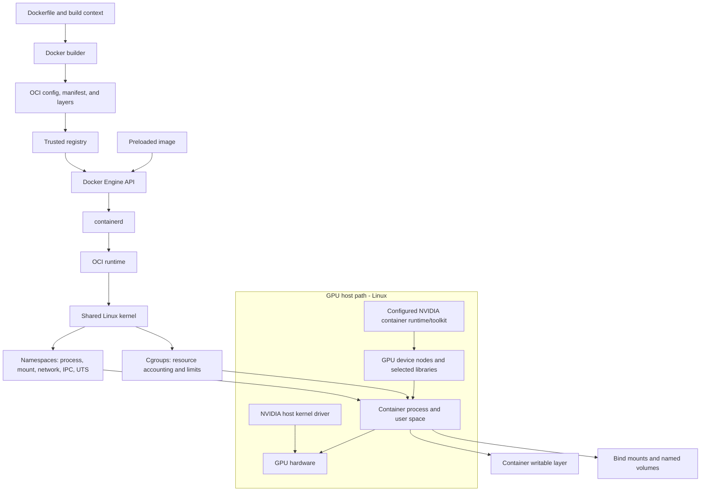

# Phase 2: Containers for AI Infrastructure

## Purpose

Containers package an application and its user-space dependencies into an image that can be started as an isolated process. For AI infrastructure, containers make model-serving and training software repeatable across worker nodes, but they do not include a separate kernel or eliminate host dependencies such as device drivers, storage, networking, and accelerator access.

This module focuses on Docker and OCI concepts used on Linux AI hosts. Docker CLI examples assume an authorized local Docker Engine unless stated otherwise. Docker daemon access is powerful and commonly equivalent to host-root access; do not add yourself to a privileged group or use `sudo` as a workaround. The GPU diagnostic uses only a trusted image already present locally, makes no image pulls, and runs no host mounts.

The running examples use **Acme AI Cloud**, a fictional provider operating GPU workers for multiple tenants. The examples explain boundaries; they do not prescribe a production security profile.

## Learning Objectives

After completing this module, you should be able to:

- Explain Docker, OCI images, OCI runtimes, registries, and the container lifecycle.
- Describe image manifests, layers, tags, digests, copy-on-write filesystems, and image provenance.
- Explain how Linux namespaces and cgroups provide isolation/accounting while sharing the host kernel.
- Choose between a read-only bind mount, named volume, and container writable layer based on data lifetime.
- Distinguish container networking modes and understand port publishing and network boundaries.
- Explain Docker Engine, containerd, and the Kubernetes Container Runtime Interface (CRI) without treating them as interchangeable products.
- Trace the GPU-container path from host kernel/driver through NVIDIA runtime device/library injection to image user space and the application.
- Build and inspect a small non-root CPU image and describe its storage and process behavior.
- Use the GPU probe to distinguish host driver/GPU availability, image utility availability, and in-container GPU access.
- Diagnose image, registry, storage, networking, cgroup, runtime, and GPU integration failures with evidence.

## Why Containers Exist

Installing every application directly on each server makes versions, libraries, files, and startup behavior drift over time. An image records a filesystem and startup configuration that can be distributed and launched consistently. This improves repeatability and deployment speed, but it does not solve compatibility, security, resource sizing, image trust, or host operations by itself.

On a GPU worker, a container image usually carries application code and user-space libraries. The host supplies the kernel and GPU driver. A configured container runtime/toolkit exposes selected device nodes and compatible host libraries. If any boundary is incompatible or unavailable, an image that works on a CPU node may not see or use a GPU.

## Simple Explanation and Analogy

Think of an image as a **sealed shipping recipe for a software work cell**. The recipe describes files and the process to start. Layers are reusable packaged increments. A registry is a distribution warehouse. A container is one running instance of that packaged filesystem with a process boundary and selected resources.

Unlike a virtual machine, a standard Linux container shares the host kernel. Namespaces change what the process can see; cgroups account for and may limit resources. The analogy is not a security proof: daemon permissions, capabilities, mounts, kernel bugs, and runtime configuration still matter.

## Architecture

### OCI and Docker Path

```text
Dockerfile + build context
		  |
		  v
Docker builder -> OCI image config + manifest/index + filesystem layers
		  |                                  |
		  |                                  v
		  +----------------------------> Registry
											 |
									  pull by tag/digest
											 v
Client/API -> Docker Engine -> containerd -> OCI runtime -> Linux kernel
									  |             |
									  |             +-> namespaces/cgroups
									  |             +-> mounts/network/process
									  v
								container process

Image layers + per-container writable layer
Named volumes / bind mounts -> data paths outside the writable layer
```

### GPU Container Path

```text
HOST (Linux)
Linux kernel -> NVIDIA kernel driver -> GPU device
					   |
					   +-> configured NVIDIA Container Toolkit/runtime hooks
									  |
									  v
IMAGE USER SPACE                    selected device nodes/libraries
Application -> CUDA/runtime libraries ------------------------------+
	  |                                                               |
	  +------------------- calls runtime/driver ----------------------+
									  |
									  v
									 GPU
```

The host driver is not normally replaced by a container's bundled user-space libraries. Which files/devices are injected depends on the supported NVIDIA Container Toolkit, runtime, driver, image, and host configuration. This diagram is conceptual; exact compatibility is version-specific. Do not install or reconfigure GPU drivers in this phase.

### Mermaid View



The container process shares the kernel; it does not boot a guest kernel. A registry supplies image content, not a running process. A container's writable layer is disposable container state, not a durable data service.

## Deep Technical Explanation

### Docker, OCI, containerd, and CRI

- **OCI image specification** defines interoperable image layout/config/manifest concepts; **OCI runtime specification** defines how a runtime starts a container from a bundle.
- **Docker Engine** is a client/server platform with an API and features such as image build, image management, networking, volumes, and container lifecycle.
- **containerd** is a container runtime daemon used by multiple platforms. It manages image transfer/storage and container lifecycle and can be integrated with Kubernetes through a CRI plugin/configuration.
- **CRI** is Kubernetes' Container Runtime Interface, a protocol between kubelet and a container runtime implementation. Docker Engine itself is not the CRI implementation in current Kubernetes architectures; historical dockershim behavior is version-specific and removed from modern Kubernetes releases.
- **runc** is a commonly used low-level OCI runtime, but runtime choices and packaging vary.

Kubernetes fundamentals and production node runtime configuration belong to the separate Kubernetes and GPU Operator learning paths. This module uses Docker CLI to make container concepts observable; do not assume every Kubernetes node uses Docker Engine.

### Images, Layers, Tags, and Digests

An image includes configuration (such as entrypoint, environment defaults, user, and working directory), one or more filesystem layers, and manifest metadata. Registry manifests may be platform-specific or reference a multi-platform image index. A pull selects content compatible with the client/daemon platform and requested platform selection.

Layers are content-addressed, reusable filesystem changes. Reusing an unchanged lower layer can reduce transfer/build work. Docker's build cache depends on instruction order and input changes; copy frequently changing files late when appropriate. The running container adds a writable layer over the image's read-only layers. Removing the container discards that layer unless data was written to an external mount.

A **tag** such as `service:stable` is a mutable name and can point to different content later. A **digest** identifies a specific manifest/content reference and is better for reproducible deployment. The local Docker image ID identifies image configuration/content locally; it is not necessarily the same as a registry manifest digest. A digest establishes content identity, not publisher authenticity. Trust also depends on the source, review, signature/attestation policy, and access controls.

Do not put secrets in a Dockerfile, build context, image layer, `ARG`, or `ENV` as a substitute for runtime secret management. Deleting a secret in a later layer does not erase it from earlier layers. The example `.dockerignore` excludes common local secret and key files, but it is a guardrail, not a complete secret scanner.

### Lifecycle

The usual path is build, inspect, tag, optionally push/pull through an approved registry, create/start a container, inspect logs/state, stop/remove it, then remove images/volumes only when they are owned by the exercise. `docker run` combines create and start. A container's main process exiting normally causes the container to stop; it is not a persistent VM. Restart policies and orchestrator reconciliation can restart a process, but neither makes an unhealthy application healthy.

The lab commands use a unique learning tag and volume name. Never use `docker system prune`, `docker volume prune`, or broad cleanup commands on a shared host; they may delete resources unrelated to the exercise.

### Namespaces and Cgroups

Linux namespaces provide scoped views such as PID, mount, network, IPC, and UTS. They change what a process sees; they do not create a separate kernel. A process can be isolated in one namespace and still share host kernel vulnerabilities or reachability granted by its configuration.

Cgroups account for and can constrain CPU, memory, I/O, and other resources, with details depending on cgroup version and runtime. `--memory` and `--cpus` are Docker resource settings, not performance guarantees. A container may fail or be OOM-killed when its limit is reached even if the host has unused capacity. Actual enforcement, defaults, and visibility depend on daemon/host configuration.

### Writable Layer, Bind Mounts, and Volumes

- The **writable layer** belongs to one container instance and disappears when that container is removed. It is useful for transient changes, not durable model artifacts or checkpoints.
- A **bind mount** exposes a specific host path inside a container. It can provide direct host file access and therefore needs tight path, mode, and identity control. A read-only mount prevents container writes through that mount but does not make other host paths safe.
- A **named volume** is managed by the container engine and has a lifecycle independent of any one container. Data persists until that exact volume is removed, subject to backend behavior.

Model files, datasets, checkpoints, and logs have different access and durability needs. The owner, retention, permissions, and backup policy must be explicit. A volume is not automatically backed up or replicated.

### Networking

Container networking is configured by the engine/runtime. A bridge network commonly provides private connectivity among attached containers and may provide outbound connectivity through host routing/NAT. Port publishing maps a host address/port to a container port; publishing on all interfaces can expose a service more widely than intended. `--network none` removes normal container network connectivity for the container; it does not disable the Docker daemon's own network access or guarantee protection from every local communication mechanism.

Host networking removes part of the network namespace boundary on supported systems and changes port behavior. It should not be used as a generic connectivity fix. Docker Desktop networking on macOS/Windows is mediated by a VM and differs from a native Linux host; GPU passthrough support is platform/runtime-specific and is not validated by this module.

### GPU Container Architecture

The workload image normally supplies the application and user-space libraries. The Linux host supplies the kernel and NVIDIA driver. A compatible NVIDIA Container Toolkit/runtime integration selects device access and may expose driver libraries/utilities to the container. The application then calls its user-space runtime/library, which reaches the host driver and GPU.

The diagnostic script distinguishes four facts: host `nvidia-smi` works and reports a GPU; Docker reaches a Linux daemon through a local Unix socket; the selected trusted image contains `/bin/sh` and `nvidia-smi`; and the `--gpus all` container can query a GPU. A failure at one point does not identify every root cause. Detailed driver/CUDA compatibility, toolkit installation, GPU Operator, scheduling, and MIG belong to later modules.

## Real-World Example: Acme Model-Serving Image

Acme builds a model-serving image from an approved base image pinned by digest. The image includes a non-root service account and the model-serving application, but not a separate host kernel. The registry uses access control and review. At deployment, the host runtime supplies the configured device access; model artifacts arrive through an approved read-only mount or artifact service, while checkpoints/logs use separate storage policy. The serving process runs under a resource budget and has only required network paths.

Operational questions include: Who approves the base image? Can its tag move? Is the digest recorded? Are credentials absent from every build layer? Which UID owns mounted artifacts? What is lost when the container is replaced? Which ports are published and to which host addresses? Does the target host have a supported driver/runtime? Is the image trusted enough to receive all GPU devices? These are design decisions, not properties guaranteed by using Docker.

## Dockerfile Examples

The examples are [Dockerfile.cpu](../../examples/containers/Dockerfile.cpu) and [Dockerfile.gpu](../../examples/containers/Dockerfile.gpu). They intentionally require a caller-selected `BASE_IMAGE`; do not copy in an arbitrary tag. Select an approved base compatible with the target Linux distribution/architecture and pin its digest for reproducible work. Verify current Dockerfile syntax and base-image support against official documentation because features and builder behavior change.

The CPU example runs as numeric UID/GID `10001:10001` and writes a marker under `/workspace/data`, which is declared as a volume. Its build-time root step only prepares that directory's ownership; the final container process is non-root. The base image must provide `/bin/sh`, `mkdir`, `chown`, `cat`, and `id`.

The GPU example does not install a driver, CUDA toolkit, or `nvidia-smi`. The selected approved base must provide `/bin/sh` and `nvidia-smi` inside the image itself: the script checks the utility before enabling GPU access. Other NVIDIA workloads may receive utilities/libraries through configured runtime injection, but that is not enough for this script's preflight. Utility availability is a precondition to the test, not proof of GPU access.

The local `.dockerignore` omits common credential files and `.git` from the build context. Inspect your actual context before building; never place real credentials or private tenant data in the examples directory.

## Command Reference

Commands assume Docker CLI and an authorized Docker daemon on Linux unless the entry says otherwise. Check tool versions and current official docs when behavior differs. Docker Engine access can grant host-root-equivalent control; do not use `sudo`, change Docker-group membership, or run untrusted images as a shortcut. Registry/build commands can access the network or modify local image state; only run them with approved images and destinations.

### Docker Engine and Context

```bash
docker version
```

- **Purpose:** Displays client and server/Engine version and API information.
- **Expected output:** Client details and, when reachable, server details.
- **Common failures:** Missing CLI gives `command not found`; a running client with no server section often means the daemon is stopped or the context/socket is inaccessible. Version skew may limit flags or APIs.

```bash
docker context show
```

- **Purpose:** Prints the selected Docker context name.
- **Expected output:** A context name, commonly `default` for a local daemon.
- **Common failures:** No usable context or missing CLI; an unexpected context may point to another host. Inspect and verify before using commands that create, stop, or delete containers.

```bash
docker context inspect CONTEXT --format '{{ (index .Endpoints "docker").Host }}'
```

- **Purpose:** Shows the daemon endpoint for the selected context. Replace `CONTEXT` with the name from `docker context show`.
- **Expected output:** A local `unix://` socket for a local Linux daemon, or a TCP/SSH endpoint for a remote daemon.
- **Common failures:** Unknown context, invalid template, or permission errors. The GPU test accepts only Unix-socket endpoints; a Unix socket alone does not prove that a privileged daemon is safe to use.

```bash
docker info --format '{{.OSType}} {{.Name}}'
```

- **Purpose:** Reports the daemon's operating-system type and host name.
- **Expected output:** Typically `linux` and the Docker daemon host name.
- **Common failures:** Daemon unreachable or access denied. The daemon host can differ from the CLI machine in VM-backed environments; compare it with the host where `nvidia-smi` ran.

### Build and Inspect Images

```bash
docker build --build-arg BASE_IMAGE="$BASE_IMAGE" -f examples/containers/Dockerfile.cpu -t containers-learning:local examples/containers
```

- **Purpose:** Builds the CPU example with a caller-provided base reference, tags the result locally, and uses `examples/containers` as the build context. Set `BASE_IMAGE` to an approved, architecture-compatible tag or preferably a reviewed digest before running.
- **Expected output:** Build steps followed by an image ID/tag on success.
- **Common failures:** Empty/invalid `BASE_IMAGE`, unavailable base, daemon down, unsupported Dockerfile feature, wrong build context, or permission failure. A base tag can move; successful build does not establish image provenance.

```bash
docker image inspect containers-learning:local --format '{{.Id}} {{json .RepoDigests}}'
```

- **Purpose:** Inspects the locally built image ID and any associated registry digests.
- **Expected output:** An image configuration ID and zero or more repository digest references. A local image may have no `RepoDigests` until it is pulled/pushed from a registry.
- **Common failures:** No such image means build/tag failed or a different daemon context is active; a format error can indicate CLI/version differences. Image ID and registry manifest digest are related but not interchangeable identifiers.

```bash
docker image ls containers-learning
```

- **Purpose:** Lists local images matching the repository/name filter.
- **Expected output:** Repository, tag, image ID, creation age, and size.
- **Common failures:** Empty result means the image is not in this daemon's local store; daemon access can fail. Displayed size may reflect shared layers and is not exact unique disk usage.
- **Common failures:** Empty result means the image is not in this daemon's local store; daemon access can fail. Displayed size may reflect shared layers and is not exact unique disk usage.

```bash
docker image history containers-learning:local
```

- **Purpose:** Displays image build history to help connect Dockerfile instructions to image layers.
- **Expected output:** A table of recorded build instructions and layer sizes where available.
- **Common failures:** Image is missing or history metadata is unavailable. History is not a complete security audit and may reveal build details.

### Run and Inspect Containers

```bash
docker run --rm containers-learning:local
```

- **Purpose:** Creates and starts a foreground container, runs its default command, then removes the container when its main process exits.
- **Expected output:** The example reports a first-run marker and UID `10001`; each `--rm` invocation gets a fresh anonymous volume.
- **Common failures:** Missing image, daemon access failure, unsupported CPU architecture, missing `/bin/sh`, or volume permission issue. `--rm` removes the container and its writable layer after exit; named volumes remain.

```bash
docker run -d --name phase2-lifecycle-UNIQUE_ID containers-learning:local /bin/sh -c 'printf "container ready\\n"; while :; do sleep 30; done'
```

- **Purpose:** Starts a uniquely named, low-activity disposable container so lifecycle commands can inspect it while running. Replace `UNIQUE_ID`; use only a personal lab daemon. The base image must provide `/bin/sh` and `sleep`.
- **Expected output:** A container ID if creation/start succeeds.
- **Common failures:** Name collision, missing image, daemon failure, or missing shell/`sleep`. Do not use a generic name that may belong to someone else.

```bash
docker ps -a --filter name=phase2-lifecycle-UNIQUE_ID
```

- **Purpose:** Lists containers, including stopped ones, whose names match the filter.
- **Expected output:** The named container in `Up` state while its sleep loop is running.
- **Common failures:** Daemon unavailable or no matching container. Container state alone does not prove application health.

```bash
docker logs phase2-lifecycle-UNIQUE_ID
```

- **Purpose:** Reads stdout/stderr captured for the named container.
- **Expected output:** The `container ready` startup line.
- **Common failures:** Container name/ID missing, logging driver limitations, or daemon access failure. Logs may contain sensitive data.
- **Common failures:** Container name/ID missing, logging driver limitations, or daemon access failure. Logs may contain sensitive data.

```bash
docker exec phase2-lifecycle-UNIQUE_ID id
```

- **Purpose:** Runs `id` as a new process in an already running container without replacing its main process.
- **Expected output:** The container process UID/GID and supplementary groups.
- **Common failures:** Container is not running, `id` is missing, or daemon access is denied. `exec` does not enter the host namespace or prove the process has all expected access.

```bash
docker exec phase2-lifecycle-UNIQUE_ID /bin/sh -c 'printf lab > /tmp/layer-marker'
```

- **Purpose:** Writes a small marker inside the exact lab-owned running container so `docker diff` can show a writable-layer change.
- **Expected output:** No output on success; `docker diff` should list `/tmp/layer-marker` as added.
- **Common failures:** Container is not running, `/bin/sh` is absent, or its root filesystem is read-only. Run only against the unique lab container; removing that container discards this marker.

```bash
docker diff phase2-lifecycle-UNIQUE_ID
```

- **Purpose:** Lists filesystem changes in the container's writable layer relative to its image.
- **Expected output:** Added/changed/deleted path markers, or no output if no writable-layer changes occurred. Volume contents are separate.
- **Common failures:** Container is missing or daemon access is denied. Do not interpret volume data as part of this writable-layer report.

```bash
docker inspect CONTAINER --format '{{.State.Status}} {{.HostConfig.Memory}} {{.HostConfig.NanoCpus}}'
```

- **Purpose:** Reads state and configured memory/CPU limits for a container. Replace `CONTAINER` with a container name/ID you created.
- **Expected output:** State plus configured limit values; zero commonly means no explicit limit in this config.
- **Common failures:** Container not found or template differences. Configured values are not measured usage or proof of resource enforcement.

```bash
readlink /proc/1/ns/pid
```

- **Purpose:** Shows the PID namespace identifier of host PID 1 from the current host view.
- **Expected output:** A symlink target such as `pid:[namespace-id]`.
- **Common failures:** `readlink` absent or `/proc` restricted. If run inside a container, PID 1 refers to that container's PID namespace, not necessarily the physical host.

```bash
docker exec CONTAINER readlink /proc/1/ns/pid
```

- **Purpose:** Shows PID 1's namespace identifier inside a running container; compare it with the authorized host-side result.
- **Expected output:** A PID namespace identifier, commonly different from the host's for a separately namespaced container.
- **Common failures:** Container not running, `readlink` absent in its image, daemon access denied, or host configuration shares the PID namespace. Namespace identifiers are evidence, not a complete security assessment.

```bash
docker exec CONTAINER readlink /proc/1/ns/net
```

- **Purpose:** Reads the network namespace identifier seen by PID 1 inside the running container.
- **Expected output:** A symlink target such as `net:[namespace-id]`; compare with the host's `/proc/1/ns/net` value.
- **Common failures:** Container not running, `readlink` absent, daemon access denied, or host-network mode sharing the host namespace. This identifies a namespace view, not reachability or full security.

```bash
docker exec CONTAINER /bin/sh -c 'cat /sys/fs/cgroup/cpu.max /sys/fs/cgroup/cpu.stat /sys/fs/cgroup/memory.max /sys/fs/cgroup/memory.current /sys/fs/cgroup/memory.events'
```

- **Purpose:** Reads visible cgroup v2 CPU/memory configuration and event counters from a running resource-limited container.
- **Expected output:** CPU quota/period or `max`, CPU counters, memory limit/current use, and event counters such as `oom`, subject to runtime/kernel configuration.
- **Common failures:** cgroup v1 uses different paths; cgroup mounts may be hidden/delegated; `cat` or `/bin/sh` may be absent; permission limits may hide counters. These files are the container's visible cgroup scope and may not show the entire host hierarchy.

```bash
docker run -d --rm --name phase2-resource-limits-UNIQUE_ID --memory=256m --cpus=0.5 containers-learning:local /bin/sh -c 'while :; do sleep 30; done'
```

- **Purpose:** Starts a low-activity disposable container with illustrative Docker memory and CPU limits. Replace `UNIQUE_ID`. The values demonstrate syntax only; they are not a workload sizing recommendation.
- **Expected output:** A container ID. While it is running, inspect it with `docker inspect` to see the configured values, then stop it; `--rm` removes it after exit.
- **Common failures:** Daemon/CLI may not support the flags, name may collide, or the base lacks `/bin/sh`/`sleep`. Use only a personal disposable host; do not generate artificial load.

```bash
docker stop CONTAINER
```

- **Purpose:** Requests a graceful stop of a running container. Replace `CONTAINER` with the unique name/ID you created.
- **Expected output:** The container name after it stops.
- **Common failures:** Container is already stopped, name is wrong, or daemon access is denied. Stopping sends a signal to the container's main process; it does not remove the container or named volumes.

```bash
docker rm phase2-lifecycle-UNIQUE_ID
```

- **Purpose:** Removes the named stopped container created by the lifecycle exercise.
- **Expected output:** The removed container name/ID.
- **Common failures:** Container is still running, the name is wrong, or daemon access is denied. Only remove the exact container created by your lab; do not add `-f` to remove an unknown running workload.

- **Purpose:** Requests a graceful stop of the named running lab container.
### Volumes and Networking

```bash
docker volume create --label com.acme.ai-infra.lab=phase2-containers phase2-data-UNIQUE_ID
```

- **Purpose:** Creates the explicitly named Docker-managed volume used in Lab 2 and attaches a marker label for ownership checks. Replace `UNIQUE_ID` with a value unique to your own exercise.
- **Expected output:** The volume name.
- **Common failures:** Daemon unavailable, storage-driver/policy error, or an existing name. Inspect the exact name first; never reuse/delete an existing volume unless you created it for this lab.

```bash
docker run --rm --mount source=phase2-data-UNIQUE_ID,target=/workspace/data containers-learning:local
```

- **Purpose:** Runs the image with the named volume mounted at its declared data path. The example writes or reads a marker there.
- **Expected output:** First run reports a new marker; a later run reports the existing marker.
- **Common failures:** Volume absent, permission/ownership mismatch, wrong image, or daemon failure. Container `--rm` does not remove this named volume.
- **Common failures:** Volume absent, permission/ownership mismatch, wrong image, or daemon failure. Container `--rm` does not remove this named volume.

```bash
docker volume inspect phase2-data-UNIQUE_ID --format '{{json .Labels}}'
```

- **Purpose:** Reads ownership labels for the named volume.
- **Expected output:** JSON containing `com.acme.ai-infra.lab=phase2-containers` for a volume created by this lab.
- **Common failures:** Volume not found, restricted daemon access, missing/mismatched label, or format differences. Do not manipulate Docker's internal volume path directly; do not delete a volume unless its unique name and lab label match.

```bash
docker volume rm phase2-data-UNIQUE_ID
```

- **Purpose:** Deletes only the named learning volume and its contents after the lab is complete.
- **Expected output:** The removed volume name.
- **Common failures:** Volume is in use by a container, misspelled name, or daemon access failure. Verify the name and contents before deletion; never use global volume-prune commands for this lab.

```bash
```bash
docker network ls
```

- **Purpose:** Lists networks known to this Docker daemon.
- **Expected output:** Network names, IDs, drivers, and scope.
- **Common failures:** Daemon is unavailable or access is denied. The list can include resources owned by other workloads; do not delete entries as cleanup for this lab.

```bash
docker network inspect bridge
```

- **Purpose:** Reads configuration for Docker's default bridge network when present.
- **Expected output:** Driver, subnet/gateway, and attached endpoint details subject to permissions.
- **Common failures:** The network may be absent or customized, or the engine may not use a bridge driver. IP details are environment-specific and can be sensitive.

```bash
docker run --rm --network none containers-learning:local
```

- **Purpose:** Runs the CPU example without normal container network connectivity.
- **Expected output:** Local process/volume output without network access.
- **Common failures:** Daemon/network-driver configuration failure or image failure. `--network none` isolates this container's normal network, not the daemon's registry traffic or all host IPC mechanisms.

```bash
docker run --rm --network none containers-learning:local /bin/sh -c 'cat /proc/net/route'
```

- **Purpose:** Displays routes visible inside a disposable container with `--network none`.
- **Expected output:** The `/proc/net/route` header and only routes exposed in this isolated network namespace; exact rows vary by engine/platform.
- **Common failures:** Base image lacks `/bin/sh` or `cat`, Docker networking setup fails, or daemon is unavailable. This only inspects the container's route view; it does not prove the host or daemon has no network access.

```bash
docker network inspect bridge --format '{{json .IPAM.Config}}'
```

- **Purpose:** Reads the default bridge network IPAM configuration when that network exists.
- **Expected output:** JSON subnet/gateway configuration, which is daemon-specific.
- **Common failures:** Network absent/customized, daemon inaccessible, or no bridge driver. Do not infer published-port reachability from this configuration alone.

```bash
docker build --build-arg PYTHON_BASE_IMAGE="$PYTHON_BASE_IMAGE" -f examples/containers/Dockerfile.http -t containers-http:local examples/containers
```

- **Purpose:** Builds the small standard-library HTTP example using a caller-selected approved Python base. Set `PYTHON_BASE_IMAGE` to a reviewed Linux image reference; pin its digest for reproducible use.
- **Expected output:** Build steps followed by a local image tag/ID.
- **Common failures:** Missing base reference, a base without `python3`, registry/daemon access failure, or incompatible architecture. This build does not pull a base unless the builder needs it and is allowed to access its registry.

```bash
docker run -d --rm --name containers-http-UNIQUE_ID -p 127.0.0.1:18080:8080 containers-http:local
```

- **Purpose:** Runs the health endpoint in a disposable container and publishes container port 8080 only on the host loopback address at port 18080. Replace `UNIQUE_ID` with a unique lab suffix.
- **Expected output:** A container ID; the service remains running until stopped.
- **Common failures:** Name or host-port collision, image missing, daemon failure, or app startup error. Binding to loopback limits exposure to the local host but does not replace host policy review.

```bash
curl --fail --silent http://127.0.0.1:18080/health
```

- **Purpose:** Sends a local HTTP request through the published host port to the container health handler.
- **Expected output:** `container-network-ok` and a zero exit status.
- **Common failures:** `curl` absent; connection refused if the container is not ready/listening; HTTP 404 for the wrong path; timeout/firewall or daemon publish failure. It tests this local path only, not remote reachability.

```bash
docker inspect containers-http-UNIQUE_ID --format '{{json .HostConfig.PortBindings}}'
```

- **Purpose:** Reads the configured host-to-container port binding.
- **Expected output:** A binding that uses host IP `127.0.0.1` and host port `18080` for container port `8080/tcp`.
- **Common failures:** Container exited/removed, name mismatch, or template/version differences. Inspect only the unique container created by this lab.

```bash
docker stop containers-http-UNIQUE_ID
```

- **Purpose:** Stops the HTTP lab container; because it was started with `--rm`, the container is removed after exit.
- **Expected output:** The container name after stop completes.
- **Common failures:** Container already exited/removed or name mismatch. Do not force-remove an unrelated container.

### Registry and Runtime Inspection

```bash
bash scripts/gpu/gpu-container-test.sh --confirm-daemon-host EXPECTED_DAEMON_HOST TRUSTED_LOCAL_IMAGE
```

- **Purpose:** On Linux, checks host-visible NVIDIA GPUs, the Docker context/daemon, a preloaded image resolved to its local image ID, and GPU visibility inside disposable containers. `EXPECTED_DAEMON_HOST` must come from an independently approved host inventory/owner. The script compares it with local `uname -n`/kernel metadata and Docker daemon name/kernel; this reduces proxy risk but does not replace owner confirmation. The image must be trusted and contain `/bin/sh` and `nvidia-smi`.
- **Expected output:** Staged `PASS` messages for caller/daemon host identity, immutable local image ID, host driver/GPU inventory, image preflight, and container GPU model. It warns if host and container model inventories differ. Each probe container uses `--pull=never`, `--rm`, `--network none`, `--read-only`, no host mounts, and `--gpus all` only for the GPU query.
- **Common failures:** Exit `2` means unsupported platform/root/arguments; `10` missing host tools; `11` context, Docker environment override, or caller/daemon identity mismatch; `12-13` daemon unavailable or non-Linux engine; `14` image absent; `15` host GPU/driver failure; `16` image shell/utility preflight failure; `17` container GPU query failure; `18` required Docker CLI/Engine flags or API level unsupported. Docker must support contexts, `--pull=never`, `--read-only`, and `--gpus`; versions and GPU support vary, so verify current official docs. Do not add `sudo`, permit a pull, switch to an unverified daemon, or run an untrusted image to get past a failure.

```bash
docker login REGISTRY_HOST
```

- **Purpose:** Authenticates the CLI to an approved registry. Use an organization-approved credential helper or interactive flow; do not place passwords/tokens in shell history or Dockerfiles.
- **Expected output:** Login success or a registry-specific authorization result.
- **Common failures:** Wrong endpoint, expired credentials, missing permissions, unavailable credential helper, or network/TLS problem. Authentication does not prove an image is trusted.

```bash
docker pull REGISTRY_HOST/PROJECT/IMAGE:TAG
```

- **Purpose:** Downloads an image reference from the specified registry to the active daemon; this changes local image state and is optional in Lab 1.
- **Expected output:** Layer download/status messages and the selected manifest/image digest.
- **Common failures:** Missing credentials, denied repository access, network/TLS errors, architecture mismatch, or missing tag. A tag can move; verify the digest and publisher through approved policy.

```bash
docker tag containers-learning:local REGISTRY_HOST/PROJECT/containers-learning:TAG
```

- **Purpose:** Adds a registry-qualified local tag without copying image layers.
- **Expected output:** No output on success; the new tag appears in `docker image ls`.
- **Common failures:** Invalid reference syntax or source image missing. Tags are mutable names; record/verify the resulting digest for reproducible use.

```bash
docker push REGISTRY_HOST/PROJECT/containers-learning:TAG
```

- **Purpose:** Uploads image layers/manifest to the selected registry; this changes remote state and is optional in Lab 1.
- **Expected output:** Layer upload/existing-layer messages and a resulting digest.
- **Common failures:** Authentication/authorization failure, repository absent, network/TLS issue, immutable-tag policy, or unsupported platform. Push only to an approved registry and never publish customer models/secrets.

```bash
docker image rm containers-learning:local
```

- **Purpose:** Removes the exact local image tag after verifying no lab container needs it.
- **Expected output:** Untagged/deleted image reference or a message that other references/layers remain.
- **Common failures:** Image is in use by a container, tag does not exist, or daemon access fails. Do not add force flags or use broad prune commands.

```bash
ctr version
```

- **Purpose:** Optionally reports the installed containerd client/server versions on an authorized Linux host.
- **Expected output:** Client and server version information if the socket is reachable.
- **Common failures:** `ctr` absent, containerd unavailable, or permission denied. `ctr` accesses a specific containerd daemon and namespace; it is not a Docker-compatible replacement for every Docker command. Do not use privileged commands to bypass access policy.

```bash
ctr namespaces list
```

- **Purpose:** Optionally lists namespaces in the containerd daemon to which this `ctr` client is connected.
- **Expected output:** Namespace names such as those configured for that host/runtime; names and visibility vary by installation.
- **Common failures:** Permission denied, unavailable socket, or `ctr` version/daemon mismatch. This is read-only and does not necessarily show Docker Engine or Kubernetes objects unless they use that same daemon/namespace.

## Hands-On Labs

**Minimum hardware:** A computer capable of reading/writing files. **Recommended:** Linux host or VM with Docker Engine; CPU-only is sufficient. **Local:** Docker Desktop on macOS can demonstrate CPU image concepts but the GPU probe is unsupported there; use a Linux VM for Linux namespace/cgroup behavior. **Cloud:** use an approved Linux VM with an authorized local Docker socket and preloaded/approved images; this module provisions no cloud resources. **On-premises:** use an owner-approved non-production Linux host. **No-GPU alternative:** complete GPU-path diagrams and use the probe's expected-failure decision tree; simulated evidence is not a successful GPU access test.

Docker daemon access is powerful. Do not add yourself to the Docker group, use `sudo`, run untrusted images, or perform broad cleanup on shared hosts. Registry push is optional and requires explicit approval/access.

### Lab 1: Build, Inspect, and Run an OCI Image

**Goal:** Follow a small image from a selected base through build, local inspection, run, and removal.

**Prerequisites**

- Docker CLI and a reachable authorized daemon. CPU-only Linux is sufficient.
- A caller-approved base image that supports the Dockerfile's `/bin/sh`, `mkdir`, `chown`, `cat`, and `id` commands. Prefer a reviewed digest and verify architecture/support.
- No registry credentials are required unless you perform the optional push step.

**Setup**

1. Review `examples/containers/.dockerignore`; never add real credentials to the build context.
2. Select an approved base reference and set `BASE_IMAGE` in your shell to its tag or digest. Record whether the reference is mutable or immutable.
3. Choose the lab tag `containers-learning:local` and confirm it is not used by another exercise.

**Steps**

1. Build the image using the documented Dockerfile command. Observe the build context and layer/cache output.
2. Inspect its local image ID and repository digests. Explain why a local image ID and registry manifest digest are not identical concepts.
3. Run the image twice with `--rm`. Each invocation should report `first run`: Docker creates a new anonymous volume for the declared `VOLUME`, then removes that anonymous volume with the container.
4. Inspect the image and container state. Explain which settings come from image configuration and which are runtime configuration.
5. Optionally tag and push only to a registry you are authorized to use. Record the registry digest returned by push; do not assume the tag is immutable.

**Validation**

- The container reports UID `10001`, confirming the runtime default is non-root.
- Both disposable runs report `first run`, demonstrating that `--rm` removes the associated anonymous volume.
- The image's configured command/user and local ID/digest information are recorded.
- Optional registry publishing uses an approved destination and contains no secrets/customer data.

**Troubleshooting**

- **Build rejects missing `BASE_IMAGE`:** Set it to an approved base reference; do not silently fall back to an unknown mutable image.
- **Base lacks a required utility:** Select a compatible approved Linux base and record it; do not install extra packages blindly.
- **Build cannot reach registry:** Check daemon context, authentication, proxy, and registry policy; local images may still be inspectable.
- **Marker write fails:** Check volume initialization ownership and container UID. Do not `chmod` host paths or run the container as root to hide the issue.
- **Tag resolves to unexpected content:** Compare digest/source policy; a tag can move between pulls.
- **Secret accidentally entered build context:** Stop, do not push; follow credential rotation/data incident procedures if it may have been captured in a layer.

**Cleanup**

Remove only `containers-learning:local` after confirming no lab container uses it. Lab 1 creates no named volume. Use the exact documented image-removal command; do not run any global prune command. If a push occurred, follow registry retention policy instead of deleting a shared tag unilaterally.

**Completion Criteria**

- You can explain the image's base, layers, config, user, entrypoint, digest/tag, and persistent-volume boundary.
- You can identify what `--rm` removes and what a named volume preserves.
- You have verified the marker behavior and recorded a trusted base-image reference.

### Lab 2: Observe Isolation, Resource Limits, Storage, and Networking

**Goal:** Connect namespaces/cgroups to observable container behavior and distinguish writable-layer and volume lifetimes.

**Prerequisites**

- Authorized Linux Docker Engine and the CPU image built in Lab 1.
- Permission to inspect only containers/networks/volumes created for this lab.
- No GPU or external network is required.

**Setup**

1. Choose a unique suffix for this run, such as a short initials/date/time string; use it consistently in `phase2-data-UNIQUE_ID` below.
2. Inspect that exact volume name. If it already exists, choose a different suffix; do not reuse or delete it unless you created it for this run.
3. Create the named volume using the documented command.
4. Choose unique names for any temporary containers created by this lab and record the current Docker context and host resource limits; do not inspect or delete unrelated workloads.

**Steps**

1. Run `containers-learning:local` twice with the same `phase2-data-UNIQUE_ID` named volume mounted at `/workspace/data`. Confirm the second run reads the first run's marker.
2. Start the low-activity lifecycle container using a unique suffix. Use the documented `docker exec` marker command, then `docker diff`; confirm `/tmp/layer-marker` is in its writable layer, not the named volume.
3. Compare host and container PID namespace identifiers. Read the container network namespace identifier as well; record namespace sharing as an observed fact, not a complete security conclusion.
4. Start the resource-limit example with a unique suffix. Inspect Docker's configured memory/CPU values and read the visible cgroup v2 files from inside that running container. Stop it and record observed values; do not generate artificial load on a shared host.
5. Run the `--network none` route-table probe and inspect the daemon's default bridge configuration. Explain that the container route view and daemon network are separate.
6. For a local port-publishing check, select an approved Python base, build `Dockerfile.http`, run it with `127.0.0.1:18080:8080`, fetch `/health` from the same host, inspect the binding, then stop the exact container. Do not expose it on `0.0.0.0` or a shared interface.
7. If `ctr` is installed and the host owner permits inspection, use only the documented read-only version/namespace commands. Record its result or the access limitation.

**Validation**

- Named-volume data persists across container replacements; writable-layer data does not.
- The marker appears in `docker diff` for the writable-layer example, but the named-volume marker persists across containers.
- Docker inspect configuration and visible cgroup files are recorded separately; limits are distinguished from observed usage or performance guarantees.
- PID/network namespace observations, `--network none`, bridge configuration, loopback port publishing, and local HTTP response are recorded.
- Namespace and cgroup claims are tied to the current Linux host/runtime view, not assumed identical across Docker Desktop/VMs.

**Troubleshooting**

- **Volume is in use:** Stop/remove only the named lab container; do not force-remove unknown containers.
- **Volume marker permission denied:** Inspect image UID and volume ownership; never broaden host permissions as a shortcut.
- **`--memory` or `--cpus` rejected:** CLI/daemon version or platform may not support the option; check current official docs and record the limitation.
- **Cannot inspect cgroups/namespaces:** Host/container namespaces or permissions may hide them; this is an evidence gap, not proof of missing isolation.
- **`ctr` is absent/denied:** Record the host/runtime boundary; do not install or escalate privileges.
- **Shared-host load concern:** Stop resource-limit experiments; use the no-load configuration-inspection path on a personal VM.
- **HTTP health check fails:** Verify the container is running, port binding is exactly `127.0.0.1:18080`, and host port 18080 is unused; do not widen the bind address as a shortcut.

**Cleanup**

Stop the exact `phase2-lifecycle-UNIQUE_ID` and `containers-http-UNIQUE_ID` containers. The resource-limit container is started with `--rm`. Remove only the exact `phase2-data-UNIQUE_ID` volume after verifying its name and ownership. No Docker network is created by these steps. Never run `docker system prune`, `docker volume prune`, or broad `rm` commands.

**Completion Criteria**

- You can explain which boundaries are namespaces, which are cgroup controls, and which are runtime policies.
- You can demonstrate data lifetime for writable layer versus named volume.
- You can explain at least one limit and networking configuration without claiming isolation is complete security.

### Lab 3: Diagnose GPU Visibility Across the Container Boundary

**Goal:** Separate host GPU/driver availability, Docker daemon/runtime readiness, image utility availability, and GPU visibility inside a container.

**Prerequisites**

- **GPU path:** Linux NVIDIA GPU host, compatible host driver, supported Docker Engine/NVIDIA Container Toolkit configuration, authorized unprivileged Docker access, and a trusted local image containing `/bin/sh` and `nvidia-smi`.
- An independently verified expected Docker daemon hostname from the host inventory or environment owner. A Unix socket may still be a local proxy to a remote daemon.
- **No-GPU path:** Any Linux host for script platform/preflight logic, or this decision-tree exercise with simulated outcomes clearly marked **ILLUSTRATION**. It is not a successful GPU validation.
- Do not install drivers/toolkits, pull an image, use production, or run an image whose publisher/content has not been approved.

**Setup**

1. Identify the approved Linux GPU host and obtain its expected daemon hostname and kernel from an independent inventory/owner source.
2. Confirm the Docker context uses a Unix socket and that Docker daemon name/kernel match the independently confirmed host and caller's `uname -n`/`uname -r`. Do not rely only on the socket path or a name copied from that same unverified daemon.
3. Select a trusted image already present locally; inspect its source and digest and ensure it has `/bin/sh` and `nvidia-smi`.
4. Understand that `--gpus all` exposes host GPU devices to the container. Container flags here do not sandbox untrusted code; the Docker daemon itself is a privileged boundary.
5. On a no-GPU host, write a simulated result matrix but label all rows as illustrations rather than measurements.

**Steps**

1. Run the documented command-reference invocation with `EXPECTED_DAEMON_HOST` and the exact preloaded image reference.
2. Record each stage: OS/root preflight, Docker context endpoint, Linux daemon host, immutable local image ID, host `nvidia-smi` result/model, image shell/utility preflight, and container GPU result/model.
3. If it succeeds, compare host and container model lists and note any discrepancy. Do not infer CUDA workload compatibility from `nvidia-smi` alone.
4. If it fails, map its exit status to the failure table below. Do not try `sudo`, image pulls, driver installation, context switching, or host mounts to force success.
5. For the no-GPU path, select one simulated failure (host driver unavailable, image utility missing, or runtime injection failure), show how the statuses differ, and explicitly state that no real hardware was tested.

**Validation**

- Host driver/GPU, image utility, and container GPU checks are reported separately.
- The image ID is resolved locally; `--pull=never` prevents test runs from pulling a replacement image.
- All probe containers use `--rm`, no network, read-only root filesystem, and no host bind mounts.
- The result identifies GPU model from host and container observations and compares their inventories.
- The caller hostname/kernel and Docker daemon name/kernel match the independently confirmed host, and no Docker environment override is set.
- The diagnostic uses only a trusted approved image and an authorized daemon.

**Troubleshooting**

- **Exit 2:** Unsupported OS, root execution, or invalid arguments; use an authorized unprivileged Linux shell and correct invocation.
- **Exit 10:** Docker or host `nvidia-smi` CLI is missing; this says nothing by itself about the physical device.
- **Exit 11:** Context endpoint is not a Unix socket, Docker environment overrides are set, or caller/daemon host identity differs; stop and confirm the target with its owner.
- **Exit 12/13:** Docker daemon unavailable or reports non-Linux engine; check authorized local service/daemon status, no reconfiguration in this lab.
- **Exit 14:** Image is not present locally or has no ID; acquire/review/pin it through an approved process before testing.
- **Exit 15:** Host GPU/driver cannot be established; stop before interpreting container results.
- **Exit 16:** Image lacks a runnable shell or `nvidia-smi`; this is an image preflight failure, not proof of runtime GPU failure.
- **Exit 17:** Container cannot query a GPU or returns no GPU; investigate supported NVIDIA runtime/toolkit/driver/image compatibility with the host owner.
- **Exit 18:** Docker CLI/Engine does not support the required flags or API level; verify current official Docker documentation rather than changing a shared daemon in the lab.
- **Model inventory warning:** The daemon's visible GPU list differs from the CLI host list; treat host/daemon locality or device selection as unresolved.

**Cleanup**

The probe uses foreground disposable `--rm` containers, no bind mounts, and no network. On interruption, allow each Docker command to exit and verify its containers are gone before rerunning; do not use broad cleanup. The script does not remove images or change daemon/driver configuration.

**Completion Criteria**

- You can distinguish host driver failure, no host GPU, missing in-image utility, daemon/context failure, and runtime injection failure.
- You understand that GPU visibility does not establish CUDA/application compatibility or benchmark performance.
- A no-GPU completion is explicitly marked simulated and does not claim hardware validation.

## Troubleshooting: Container and GPU Boundaries

| Symptom | Detection | Diagnosis focus | Safe next step | Prevention |
| --- | --- | --- | --- | --- |
| Image build uses unexpected files | Build output/context, `.dockerignore`, image inspect | Wrong build context or ignored/unignored files | Stop before push; inspect context and rebuild from reviewed inputs | Small contexts, `.dockerignore`, code review |
| Image works by tag then changes later | Tag reference versus registry digest | Mutable tag points to changed content | Resolve and record approved digest; verify publisher | Deploy by reviewed digest, maintain provenance |
| Container exits immediately | `docker ps -a`, logs, exit code | Main process completed or failed; container is not a VM | Inspect exact container logs/state | Correct command/health model, not arbitrary restart policy |
| Container cannot read a mounted model | UID/GID, mount mode, ACL, path visibility | Host path permission, mount target, namespace | Ask data/host owner for approved read-only check | Align identity and artifact policy before deployment |
| Data vanishes after removal | Container writable layer vs named volume | Data was written only to per-container layer | Restore from approved artifact/checkpoint source | Define durable storage/backup contract |
| Port is listening but client cannot connect | Bind address, published port, firewall, route, app readiness | Namespace, port publishing, host policy, or service state | Trace approved client path | Bind/publish only required addresses and ports |
| Container process is throttled or OOM-killed | `docker inspect` limits, host/cgroup counters, exit state | Configured cgroup limits vs host capacity | Workload owner sizes limits using evidence | Load-test representative workloads and alert on limits |
| Docker command is denied | Context endpoint, socket permissions, daemon owner | Docker API/root-equivalent boundary | Request approved access; do not add Docker group or use sudo | Managed role access and daemon separation |
| Image cannot be pulled/pushed | Registry auth, network/TLS, repository permissions | Identity, registry policy, architecture, or endpoint | Ask registry owner and use approved credential flow | Trusted registry, scoped credentials, pinned digest |
| GPU exists on host but not in container | Host `nvidia-smi`, daemon host, image utility, container query | Driver, context, NVIDIA Toolkit/runtime, image compatibility | Preserve staged outputs and hand off to GPU platform owner | Validate on target host/image release pipeline |
| Container says `nvidia-smi` missing | Image preflight status, image layers/runtime integration | Utility absent from image and not injected | Use an approved diagnostic image that explicitly supports the probe | Document base-image/runtime contract |
| containerd output differs from Docker | Runtime name, CRI configuration, containerd namespace | Different daemon/namespace/storage view | Inspect only with runtime owner and read-only permissions | Document node runtime and supported tooling |
| GPU test targets surprising hardware | Context endpoint, Docker daemon name, model comparison | CLI host and daemon host/device inventory differ | Stop and select an approved local Linux context | Avoid remote contexts for host-vs-container comparisons |
| GPU test image is untrusted | Registry origin/digest/approval record | Image publisher or content is not verified | Do not run with `--gpus all`; obtain an approved diagnostic image | Image review, provenance/signature policy, access control |

The container diagnostic does not validate model correctness, CUDA compatibility, GPU performance, tenant isolation, or image authenticity. Those require later modules and approved platform controls.

## Interview Preparation

### Technical Questions and Answers

**1. What does OCI standardize, and what does Docker provide?**  
OCI specifies interoperable image and runtime formats. Docker Engine adds a client/API, builder, image management, networks, volumes, and lifecycle features. OCI is not a registry or running container service by itself.

**2. Why is a container not a virtual machine?**  
A normal Linux container shares the host kernel and uses namespaces/cgroups and runtime configuration to scope processes/resources. A VM boots a guest kernel under a hypervisor. The isolation and failure boundaries differ.

**3. What is the difference between a layer, image ID, tag, and digest?**  
Layers are filesystem changes; the local image ID identifies image configuration/content in the engine; a tag is a mutable human-readable reference; a registry digest identifies specific manifest content. A digest does not prove publisher trust.

**4. What happens to data when a container stops or is removed?**  
Stopping preserves the container and its writable layer; removing it discards that layer. Named volumes persist independently until removed, while bind mounts expose host paths. Neither persistence type automatically gives backups.

**5. How do namespaces and cgroups differ?**  
Namespaces scope what processes can see; cgroups account for and can constrain resource use. Both rely on host-kernel mechanisms and their exact enforcement depends on configuration.

**6. Explain Docker Engine, containerd, and CRI.**  
Docker Engine is a client/server container platform. containerd manages image and container lifecycle and may provide Kubernetes CRI integration. CRI is the kubelet-to-runtime interface; Docker Engine is not itself the modern CRI implementation.

**7. Why can an image run on CPU but fail to use a GPU?**  
The image user space is only one part of the path. The host needs a supported kernel driver, device access, and compatible runtime/toolkit injection; the image needs compatible user-space libraries and application support.

**8. Is `--network none` a complete security boundary?**  
No. It removes normal network connectivity for that container configuration, but it does not disable daemon networking, prevent every local communication path, or compensate for dangerous mounts/capabilities or kernel vulnerabilities.

**9. Is running as non-root sufficient for a trusted container?**  
No. It reduces some process privileges but does not make an untrusted image safe, undo daemon privileges, guarantee device isolation, or replace access controls, image review, seccomp/capability policy, and host patching.

**10. What does the GPU probe prove?**  
It establishes that host `nvidia-smi` reports a GPU and that a selected container can query GPU visibility through the configured runtime. It does not prove CUDA application compatibility, model fit, performance, or security isolation.

**11. Why avoid using `docker system prune` for lab cleanup?**  
It can delete unrelated images, stopped containers, networks, caches, or volumes on a shared daemon. Remove only the exact resources created by the exercise.

**12. What does `containerd` `ctr` namespace output mean?**  
It shows namespaces in that containerd daemon. Docker Engine and Kubernetes may use different daemons/namespaces, so `ctr` visibility does not automatically match `docker ps` or Kubernetes workload visibility.

### Architecture and Trade-Off Questions

**Acme needs reproducible inference deployments across several GPU nodes. How do you choose image references and registry controls?**  
Use approved base images, record a digest for deployment, and retain the human-readable tag as metadata. Establish publisher/provenance verification separately because digest identity alone does not establish authenticity. Restrict registry credentials and promotion; ensure secrets never enter build context or layers.

**A pod/container exits and its model cache disappears. What design decision was likely missed?**  
The data may have been written to the container writable layer. Determine whether it is disposable cache, durable model artifact, or checkpoint; select a volume/object/artifact path with explicit ownership, retention, access, and backup/recovery behavior.

**Would you use host networking for an inference service?**  
Only if a measured requirement justifies it and the security/port-collision consequences are accepted. Prefer scoped bridge/overlay/service networking and explicit port publishing. Host networking changes isolation and should not be a generic response to a connectivity issue.

**A trusted image runs `nvidia-smi` on the host but fails inside a container. How would you triage it?**  
Confirm host and Docker daemon refer to the same Linux GPU host; inspect approved image ID and utility availability; separate device allocation from runtime/toolkit injection and driver/library compatibility; preserve command/output/versions; then route to the GPU platform owner. Do not install toolkit or change daemon configuration in a learning exercise.

**How do you balance a read-only root filesystem with applications that need scratch space?**  
Keep root filesystems immutable where feasible and provide explicit writable tmpfs/volume paths with size, ownership, and retention policy. Separate scratch from durable model/checkpoint storage, and test startup/write behavior under the intended UID and limits.

## Completion Checklist

- [ ] Explain OCI image/runtime roles and distinguish Docker Engine, containerd, and CRI.
- [ ] Describe image config, layers, writable layer, manifest/index, tag, local ID, and registry digest accurately.
- [ ] Demonstrate a build/run/inspect/log/stop/remove lifecycle using owned lab resources only.
- [ ] Explain PID/mount/network namespaces and cgroup limits as host-kernel mechanisms.
- [ ] Demonstrate container writable-layer versus named-volume lifetime and clean up only the lab volume.
- [ ] Explain container networking mode and port publishing risks.
- [ ] Explain host-driver and runtime-injected GPU access versus image user-space dependencies.
- [ ] Run the GPU diagnostic only on an authorized Linux host with a trusted preloaded image, or complete a clearly simulated no-GPU path.
- [ ] Diagnose at least three failure cases by stage and identify the appropriate owner.
- [ ] Answer the technical and architecture questions with explicit trust, data-lifetime, isolation, and operational trade-offs.
- [ ] Leave no lab-created containers, volumes, networks, credentials, or published unapproved images.

## Scope Note

Kubernetes fundamentals are covered separately through KodeKloud. This module introduces container concepts needed for AI worker operations; GPU fundamentals, CUDA compatibility, GPU Operator installation, cluster scheduling, and production container-security controls are deferred to their roadmap modules.
